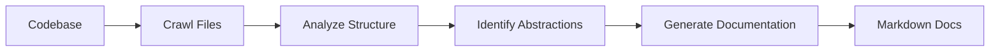

# Salt Docs CLI

Wiki's for nerds, by nerds

## How it works



## Installation

### Option 1: Install from PyPI
```bash
pip install salt-docs
```

### Option 2: Install from source
```bash
git clone https://github.com/your-org/salt-docs-cli.git
cd salt-docs-cli
pip install -e .
```

## Quick Start

### 1. Initial Setup
Run the setup wizard to configure your API keys and preferences:

```bash
salt-docs init
```

This will:
- Prompt for your Gemini API key
- Optionally ask for GitHub token (for private repos)
- Set default output location (`~/Documents/Salt Docs`)
- Configure other preferences

### 2. Generate Documentation

#### Analyze GitHub repository
```bash
salt-docs --repo https://github.com/username/repo
```

#### Analyze local directory
```bash
salt-docs --dir /path/to/your/codebase
```

#### With custom options
```bash
salt-docs --repo https://github.com/username/repo --output /custom/path --language spanish --max-abstractions 15
```

## Configuration

Salt Docs stores configuration in `~/Documents/Salt Docs/.salt/config.json` and uses your system's keyring for secure API key storage.

### Configuration Options
- `output_dir`: Default output directory
- `language`: Default language for generated docs
- `max_abstractions`: Default number of abstractions to identify
- `max_file_size`: Maximum file size in bytes
- `use_cache`: Enable/disable LLM response caching
- `include_patterns`: Default file patterns to include
- `exclude_patterns`: Default file patterns to exclude

### Managing Configuration

#### View Current Configuration
```bash
salt-docs config show
```

#### Update API Keys
```bash
# Update Gemini API key (interactive)
salt-docs config update-gemini-key

# Update Gemini API key directly
salt-docs config update-gemini-key "your-api-key-here"

# Update GitHub token (interactive)
salt-docs config update-github-token

# Update GitHub token directly
salt-docs config update-github-token "your-token-here"
```

#### Update Other Settings
```bash
# Change default language
salt-docs config set language spanish

# Change max abstractions
salt-docs config set max_abstractions 15

# Disable caching
salt-docs config set use_cache false

# Update output directory
salt-docs config set output_dir /custom/path
```

## CLI Options

### Required
- `--repo` or `--dir` - GitHub repo URL or local directory path

### Optional
- `-n, --name` - Project name (derived from repo/directory if omitted)
- `-t, --token` - GitHub personal access token
- `-o, --output` - Output directory (overrides config default)
- `-i, --include` - File patterns to include (e.g., "*.py", "*.js")
- `-e, --exclude` - File patterns to exclude (e.g., "tests/*", "docs/*")
- `-s, --max-size` - Maximum file size in bytes (default: 100KB)
- `--language` - Language for generated docs (default: "english")
- `--no-cache` - Disable LLM response caching
- `--max-abstractions` - Maximum number of abstractions to identify (default: 10)

## Migration from Old Version

If you were using the old `python main.py` approach:

1. Install the new CLI: `pip install -e .`
2. Run setup: `salt-docs init`
3. Use the new commands: `salt-docs --repo <url>`

The old approach is no longer supported - please use the new CLI commands.

## Development

### Setup for Development
```bash
git clone https://github.com/your-org/salt-docs-cli.git
cd salt-docs-cli
pip install -e .
salt-docs init
```