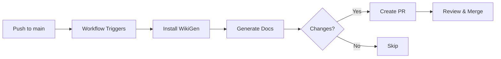

# CI/CD Integration Guide

This guide explains how to integrate WikiGen into your CI/CD pipeline to automatically generate and update documentation whenever code changes are pushed to your repository.

## Quick Start

### 1. Add Workflow File

Create `.github/workflows/wikigen.yml` in your repository:

```yaml
name: WikiGen - Auto Documentation

on:
  push:
    branches:
      - main  # Change to your default branch

jobs:
  generate-docs:
    runs-on: ubuntu-latest
    permissions:
      contents: write
      pull-requests: write
    
    steps:
      - uses: actions/checkout@v4
      - uses: actions/setup-python@v5
        with:
          python-version: '3.12'
      
      - name: Install WikiGen
        run: pip install wikigen
      
      - name: Generate Documentation
        run: |
          wikigen run . --ci --output-path docs/
        env:
          GEMINI_API_KEY: ${{ secrets.GEMINI_API_KEY }}
      
      - name: Create Pull Request
        uses: peter-evans/create-pull-request@v6
        with:
          commit-message: 'docs: updated documentation for new changes'
          branch: wikigen/update-${{ github.run_number }}
          title: 'Update Documentation'
```

### 2. Configure GitHub Secrets

Add your LLM API key to GitHub Secrets:

1. Go to your repository → **Settings** → **Secrets and variables** → **Actions**
2. Click **New repository secret**
3. Add one of the following based on your LLM provider:
   - `GEMINI_API_KEY` (for Google Gemini - default)
   - `OPENAI_API_KEY` (for OpenAI)
   - `ANTHROPIC_API_KEY` (for Anthropic Claude)
   - `OPENROUTER_API_KEY` (for OpenRouter)

### 3. Configure Variables (Optional)

For additional customization, add repository variables:

1. Go to **Settings** → **Secrets and variables** → **Actions** → **Variables**
2. Add any of these optional variables:
   - `WIKIGEN_LLM_PROVIDER` - LLM provider (default: `gemini`)
   - `WIKIGEN_LLM_MODEL` - Model name (default: `gemini-2.0-flash-exp`)
   - `WIKIGEN_OUTPUT_PATH` - Output directory (default: `docs`)
   - `WIKIGEN_LANGUAGE` - Documentation language (default: `english`)
   - `WIKIGEN_MAX_ABSTRACTIONS` - Max abstractions (default: `10`)

## How It Works



1. **Trigger**: Workflow runs on every push to main/master
2. **Setup**: Installs Python and WikiGen
3. **Generate**: Runs `wikigen run . --ci --output-path docs/`
4. **Detect Changes**: Checks if documentation was updated
5. **Create PR**: If changes detected, creates a PR with updated docs
6. **Review**: Team reviews and merges the PR

## CLI Flags for CI

WikiGen provides special flags for CI/CD workflows:

| Flag | Description |
|------|-------------|
| `--ci` | Enable CI mode (non-interactive, better error messages) |
| `--output-path <path>` | Custom output directory (e.g., `docs/`, `documentation/`) |
| `--update` | Merge with existing docs instead of overwriting |
| `--check-changes` | Exit with code 1 if docs changed, 0 if unchanged |

### Example Usage

```bash
# Basic CI usage
wikigen run . --ci --output-path docs/

# Update existing docs
wikigen run . --ci --update --output-path docs/

# Check for changes (for conditional PR creation)
wikigen run . --ci --check-changes --output-path docs/
if [ $? -eq 1 ]; then
  echo "Documentation changed"
fi
```

## Advanced Configuration

### Multiple Branches

Monitor multiple branches:

```yaml
on:
  push:
    branches:
      - main
      - develop
      - release/*
```

### Custom Output Paths

Generate docs in different locations:

```yaml
- name: Generate Documentation
  run: |
    wikigen run . --ci --output-path documentation/
```

### Conditional Execution

Only run on specific file changes:

```yaml
on:
  push:
    branches:
      - main
    paths:
      - 'src/**'
      - 'lib/**'
      - '!docs/**'  # Ignore doc changes
```

### Using Different LLM Providers

#### OpenAI

```yaml
- name: Generate Documentation
  run: |
    wikigen run . --ci --output-path docs/
  env:
    OPENAI_API_KEY: ${{ secrets.OPENAI_API_KEY }}
```

Set `WIKIGEN_LLM_PROVIDER=openai` and `WIKIGEN_LLM_MODEL=gpt-4o-mini` in repository variables.

#### Anthropic Claude

```yaml
- name: Generate Documentation
  run: |
    wikigen run . --ci --output-path docs/
  env:
    ANTHROPIC_API_KEY: ${{ secrets.ANTHROPIC_API_KEY }}
```

Set `WIKIGEN_LLM_PROVIDER=anthropic` and `WIKIGEN_LLM_MODEL=claude-3-5-sonnet-20241022` in repository variables.

## Troubleshooting

### API Key Not Found

**Error**: `API key not found`

**Solution**: Ensure you've added the correct secret name:
- For Gemini: `GEMINI_API_KEY`
- For OpenAI: `OPENAI_API_KEY`
- For Anthropic: `ANTHROPIC_API_KEY`

### Permission Denied

**Error**: `Permission denied` when creating PR

**Solution**: Ensure workflow has proper permissions:

```yaml
permissions:
  contents: write
  pull-requests: write
```

### No Changes Detected

**Issue**: Workflow runs but no PR is created

**Cause**: Documentation hasn't changed since last run

**Solution**: This is expected behavior. PRs are only created when docs change.

### Rate Limiting

**Error**: `Rate limit exceeded`

**Solution**: 
- Use a GitHub token with higher rate limits
- Add caching to avoid regenerating unchanged docs
- Use `--update` flag to merge with existing docs

## Best Practices

### 1. Use Branch Protection

Require PR reviews before merging documentation updates:

```yaml
# .github/workflows/wikigen.yml
- name: Create Pull Request
  uses: peter-evans/create-pull-request@v6
  with:
    reviewers: team-leads
    assignees: ${{ github.actor }}
```

### 2. Add Quality Checks

Validate documentation before creating PR:

```yaml
- name: Validate Documentation
  run: |
    # Check for broken links
    # Validate markdown syntax
    # Ensure no sensitive data
```

### 3. Customize PR Labels

Organize PRs with labels:

```yaml
- name: Create Pull Request
  uses: peter-evans/create-pull-request@v6
  with:
    labels: |
      documentation
      automated
      needs-review
```

### 4. Schedule Regular Updates

Run documentation generation on a schedule:

```yaml
on:
  schedule:
    - cron: '0 0 * * 0'  # Weekly on Sunday
  push:
    branches:
      - main
```

## Future Integrations

WikiGen is designed to support multiple documentation platforms. Future versions will support:

- **Confluence**: Automatic wiki page updates
- **Notion**: Database and page synchronization
- **GitBook**: Direct integration
- **ReadTheDocs**: Automated builds
- **Custom APIs**: Webhook support for any platform

To prepare for these integrations, use the `--output-path` flag to organize your documentation structure.

## Example Workflows

### Complete Workflow with All Features

See [`.github/workflows/wikigen.yml`](file:///.github/workflows/wikigen.yml) in this repository for a complete example with:
- Multi-provider support
- Configurable options
- Error handling
- PR automation
- Change detection

### Minimal Workflow

For simple projects:

```yaml
name: Docs

on:
  push:
    branches: [main]

jobs:
  docs:
    runs-on: ubuntu-latest
    steps:
      - uses: actions/checkout@v4
      - uses: actions/setup-python@v5
      - run: pip install wikigen
      - run: wikigen run . --ci --output-path docs/
        env:
          GEMINI_API_KEY: ${{ secrets.GEMINI_API_KEY }}
      - uses: peter-evans/create-pull-request@v6
        with:
          commit-message: 'docs: update'
          branch: docs-update
```

## Support

For issues or questions:
- GitHub Issues: [usesalt/wikigen](https://github.com/usesalt/wikigen/issues)
- Documentation: [README.md](../README.md)
