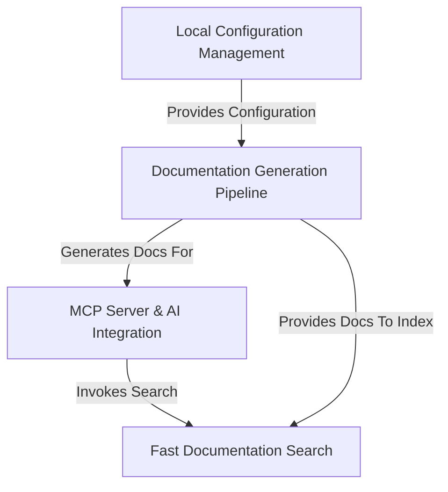
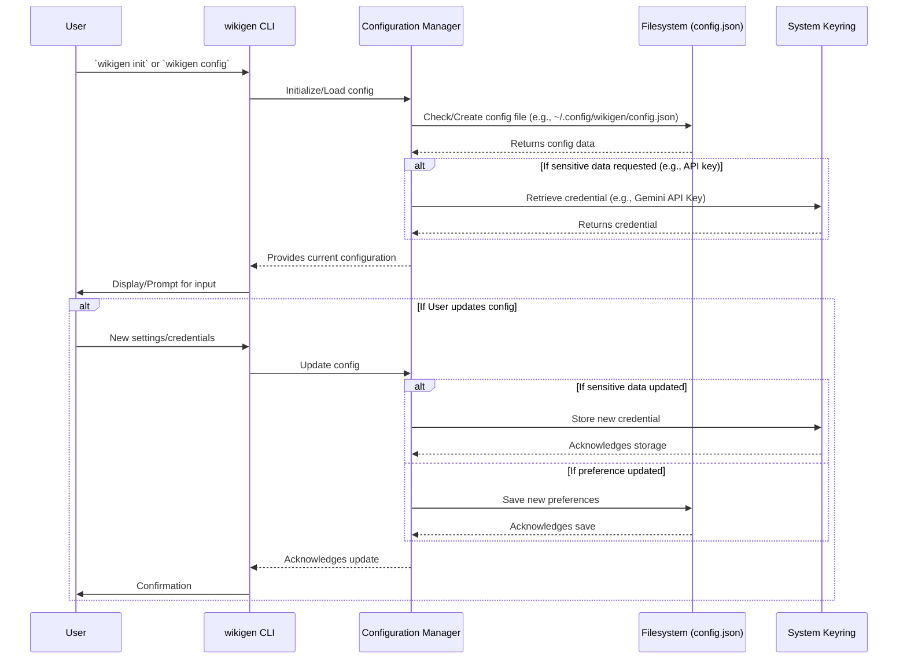
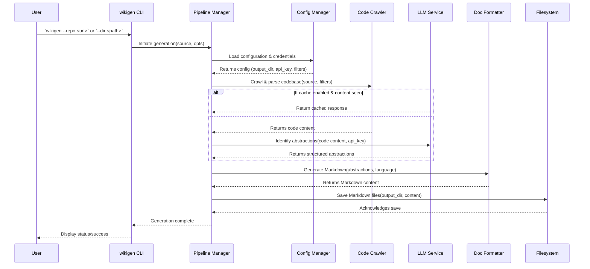
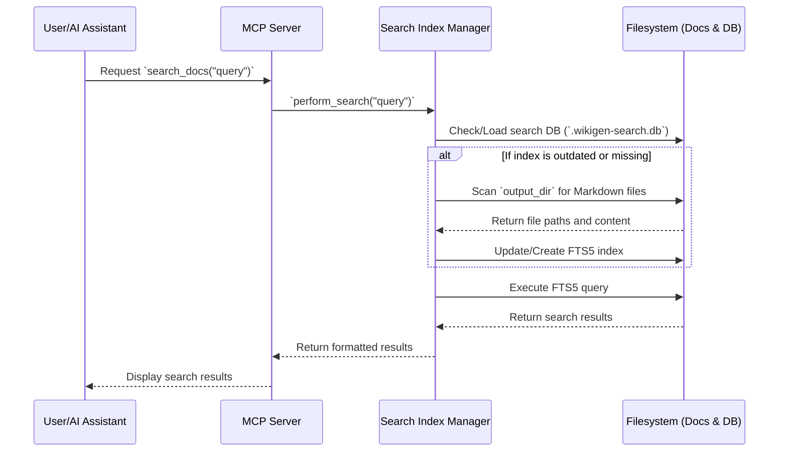
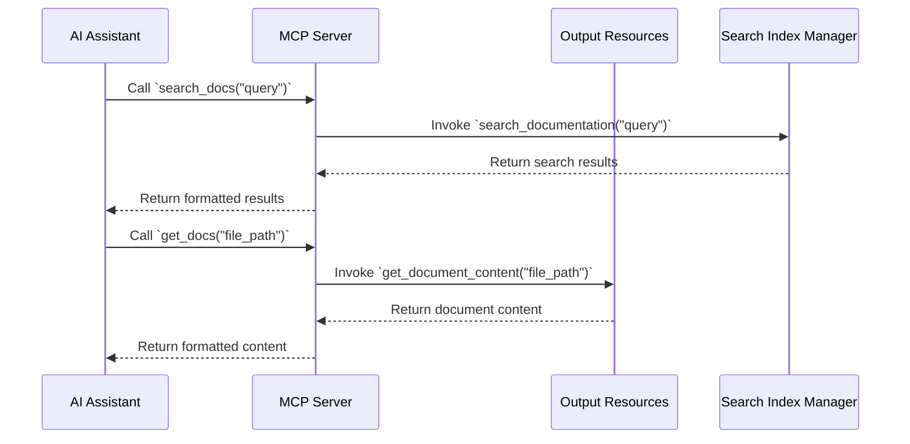

# wikigen

`wikigen` is a **local-first** CLI tool designed to _auto-generate wikis and documentation_ from codebases, addressing the challenge of context loss across repositories. Its core functionality is driven by the **Documentation Generation Pipeline**, which _crawls and parses_ source code (from local directories or GitHub), employs **Large Language Models (LLMs) via a BYOK (Bring Your Own Key) model** to _identify and extract key abstractions_, and then _formats this information into structured markdown files_.

A pivotal architectural component is the **MCP Server & AI Integration**, which establishes a _local Model Context Protocol server_. This server exposes the generated documentation as a set of _queryable tools_ (`list_docs`, `get_docs`, `search_docs`, `index_directories`) to AI coding assistants like Cursor, Continue, and Claude Desktop, enabling them to retrieve _project-specific, relevant context_ directly from the codebase's documentation.

For efficient information access, the project incorporates **Fast Documentation Search**, leveraging _SQLite FTS5_ to provide _high-performance, full-text search_ capabilities across all generated markdown files. This search mechanism is _integral_ to the `search_docs` MCP tool, ensuring rapid and accurate retrieval of codebase context.

All user-specific settings, preferences, and _sensitive credentials_ like Gemini API keys and GitHub tokens are managed securely by the **Local Configuration Management** abstraction. This system stores configuration files in _OS-appropriate directories_ and utilizes _system keyring services_ for sensitive data, offering an _interactive setup wizard_ and _automatic migration_ from legacy configurations while upholding user privacy. The entire architecture emphasizes a _privacy-first approach_, ensuring code never leaves the user's machine.


**Source Repository:** [None](None)



## Components

1. [Local Configuration Management](01_local_configuration_management_.md)
2. [Documentation Generation Pipeline](02_documentation_generation_pipeline_.md)
3. [Fast Documentation Search](03_fast_documentation_search_.md)
4. [MCP Server & AI Integration](04_mcp_server___ai_integration_.md)


---

## Component 1: Local Configuration Management

This component is the bedrock for personalizing and securing the `wikigen` experience for every engineer. In complex development environments, engineers juggle numerous projects, often requiring unique settings, API keys, and preferences. The **Local Configuration Management** component addresses the critical need for a robust, secure, and user-friendly system to manage all user-specific operational parameters, ensuring both ease of use and stringent privacy.

### Core Responsibilities

The primary goal of this abstraction is to handle all aspects of user configuration, from initial setup to ongoing maintenance. Its core responsibilities include:

*   **Secure Credential Storage**: Safely stores sensitive information like Gemini API keys and GitHub tokens using OS-native keyring services, preventing plain-text storage and unauthorized access.
*   **Persistent User Preferences**: Manages user-defined settings such as default output directories, preferred languages, caching preferences, and file pattern filters.
*   **OS-Appropriate Directory Handling**: Ensures configuration files are stored in standard, OS-specific locations (e.g., `~/.config/wikigen` on macOS/Linux and `%APPDATA%\wikigen` on Windows) for consistency and discoverability.
*   **Interactive Initial Setup**: Provides a guided wizard (`wikigen init`) for first-time users to set up essential configurations and credentials effortlessly.
*   **Configuration Management CLI**: Offers a comprehensive command-line interface (`wikigen config`) for viewing, updating, and resetting specific configuration parameters.
*   **Automatic Configuration Migration**: Gracefully handles transitions from older configuration formats or locations, ensuring backward compatibility and a seamless upgrade experience.
*   **Upholding Privacy**: A foundational principle is that all user data and credentials remain local to the machine, never being transmitted to external services beyond direct interaction with the respective API providers (e.g., Google Gemini).

### Key Concepts

#### Secure Credential Storage with Keyring Services

Sensitive data, particularly API keys and tokens, are never stored directly in the `config.json` file. Instead, the component leverages system keyring services (like `keyring` in Python, which integrates with macOS Keychain, Windows Credential Manager, and Linux equivalents). This method encrypts and stores credentials securely, accessible only by the current user's operating system.

#### OS-Appropriate Configuration Paths

Adhering to operating system conventions is crucial for maintainability and user expectations.
*   On **macOS and Linux**, configurations are stored under `~/.config/wikigen/config.json` or `$XDG_CONFIG_HOME/wikigen/config.json`.
*   On **Windows**, it utilizes `%APPDATA%\wikigen\config.json`.

This ensures that `wikigen` integrates cleanly with the user's environment. The `CHANGELOG.md` reflects this significant improvement in version `0.1.8`.

#### Interactive Setup Wizard

The `wikigen init` command guides users through a simple, interactive process to set up their environment. This includes prompting for necessary API keys (with input masking) and setting default preferences, dramatically reducing the barrier to entry for new users.

#### Configuration Schema

The `config.json` file stores non-sensitive preferences. A typical configuration might look like this:

```json
{
  "output_dir": "/Users/user/Documents/WikiGen",
  "language": "english",
  "max_abstractions": 5,
  "max_file_size": 102400,
  "use_cache": true,
  "include_patterns": ["*.py", "*.js"],
  "exclude_patterns": ["tests/*", "docs/*"],
  "last_update_check": "2025-01-28T10:30:00"
}
```

These settings are fully configurable via the `wikigen config set` commands.

### Internal Implementation

The **Local Configuration Management** component operates through a central configuration manager that interacts with the file system for preferences and the system keyring for sensitive data.

#### Workflow for Configuration Access and Modification



#### Code Walkthrough

The core logic resides within a `config.py` module (or similar structure), encapsulating functions for path resolution, loading, saving, and keyring interactions.

##### 1. Determining OS-Appropriate Config Path

The system dynamically determines the configuration file path based on the operating system. This logic is crucial for adhering to OS conventions.

```python
# Part of a larger module, depends on 'os' and 'sys'
def get_config_path() -> str:
    """Determines the OS-appropriate configuration directory."""
    if sys.platform == "win32":
        base_dir = os.environ.get("APPDATA")
        config_dir = os.path.join(base_dir, "wikigen")
    # ... similar logic for macOS using ~/Library/Application Support ...
    else: # Example for Linux/other standard path
        config_dir = os.path.join(os.path.expanduser("~"), ".config", "wikigen")
    
    os.makedirs(config_dir, exist_ok=True)
    return os.path.join(config_dir, "config.json")
```
*Explanation*: This function inspects `sys.platform` to tailor the path resolution. The snippet shows an example for Windows and a common fallback for Linux/macOS. It ensures the configuration directory exists before returning the full file path.

##### 2. Loading and Migrating Configuration

When the application starts or configuration is requested, the system attempts to load `config.json`. It also includes logic for migrating from legacy paths, as detailed in the `CHANGELOG.md` entry for `0.1.8`.

```python
# Part of a larger module, depends on 'json' and 'os'
def load_config(config_path: str) -> dict:
    """Loads configuration, handling legacy migration and defaults."""
    config_data = {}
    
    # Check and migrate from legacy config location (see CHANGELOG 0.1.8)
    # ... (detailed migration logic omitted for brevity) ...

    if os.path.exists(config_path):
        with open(config_path, 'r') as f:
            config_data.update(json.load(f)) # Merge existing config
    
    config_data.setdefault("output_dir", os.path.join(os.path.expanduser("~"), "Documents", "WikiGen"))
    config_data.setdefault("language", "english")
    # ... other defaults ...
    return config_data
```
*Explanation*: This `load_config` function first checks for and processes any legacy configuration. Then, it loads the current `config.json` (if it exists) and merges its settings. Finally, it ensures all required configuration keys have default values, providing a robust initial state.

##### 3. Saving Configuration

Updates to non-sensitive settings are saved back to the `config.json` file.

```python
# Part of a larger module, depends on 'json' and 'os'
def save_config(config_path: str, config_data: dict):
    """Saves the current configuration data."""
    try:
        os.makedirs(os.path.dirname(config_path), exist_ok=True)
        with open(config_path, 'w') as f:
            json.dump(config_data, f, indent=2)
    except IOError as e:
        print(f"Error saving config: {e}")
```
*Explanation*: The `save_config` function serializes the current configuration dictionary to the `config.json` file. It ensures the parent directory exists before writing and includes basic error handling for file operations.

##### 4. Keyring Integration (Abstracted)

Interaction with the system keyring is typically abstracted through a dedicated utility or a `keyring` library wrapper. This separates credential management from general preferences.

```python
# Part of a larger module, depends on the 'keyring' library
SERVICE_NAME = "wikigen"

def get_secret(key_name: str) -> str | None:
    """Retrieves a secret from the system keyring."""
    # This internally calls keyring.get_password(SERVICE_NAME, key_name)
    return "retrieved_secret_value" # Simplified representation

def set_secret(key_name: str, value: str):
    """Stores a secret in the system keyring."""
    # This internally calls keyring.set_password(SERVICE_NAME, key_name, value)
    print(f"Secret '{key_name}' stored.") # Simplified representation
```
*Explanation*: These functions provide a simple interface for interacting with the system keyring. `SERVICE_NAME` helps categorize credentials within the keyring, and the actual keyring calls are abstracted away in this simplified representation.

#### Initial Setup Wizard (`wikigen init`)

The `init` command orchestrates the initial configuration by calling the above functions interactively. It prompts the user for necessary information, uses `set_secret` for API keys, and `save_config` for general preferences.

```python
# Simplified snippet from init.py, depends on 'rich.prompt' and config functions
def run_init_wizard():
    print("Welcome to WikiGen CLI setup wizard!")
    
    # Prompt for Gemini API Key
    gemini_key = Prompt.ask("Enter your Gemini API key", password=True)
    if gemini_key:
        set_secret("gemini_api_key", gemini_key)
    
    # Prompt for other sensitive data (e.g., GitHub token)
    # and general preferences (e.g., output_dir) similarly.
    
    print("Setup complete! You can now generate documentation.")
```
*Explanation*: This snippet shows how the `init` wizard prompts for sensitive keys using a masked input (provided by `rich.prompt.Prompt`), then saves them using `set_secret`. Other general settings are handled similarly, involving `load_config` and `save_config`.

### Concrete Usage Examples

The `wikigen` CLI provides direct access to manage configurations.

#### 1. Initial Setup with Wizard

First-time users will run the interactive setup wizard:

```bash
wikigen init
```
This command will guide you through setting up your Gemini API key, GitHub token (optional), and other core preferences, saving them securely.

#### 2. Viewing Current Configuration

To inspect your current non-sensitive settings:

```bash
wikigen config show
```
Output (example):
```json
{
  "output_dir": "/Users/user/Documents/WikiGen",
  "language": "english",
  "max_abstractions": 5,
  "max_file_size": 102400,
  "use_cache": true,
  "include_patterns": ["*.py", "*.js"],
  "exclude_patterns": ["tests/*", "docs/*"],
  "last_update_check": "2025-01-28T10:30:00"
}
```

#### 3. Updating Sensitive API Keys

To update your Gemini API key:

```bash
wikigen config update-gemini-key
# You will be prompted to enter the new key securely.
```

Alternatively, for non-interactive updates (e.g., in scripts, though generally less secure for secrets):

```bash
wikigen config update-gemini-key "your-new-gemini-api-key-here"
```

Similarly for the GitHub token:

```bash
wikigen config update-github-token
```

#### 4. Modifying General Settings

To change the default language for generated documentation to Spanish:

```bash
wikigen config set language spanish
```

To disable LLM response caching:

```bash
wikigen config set use_cache false
```

To update the default output directory:

```bash
wikigen config set output_dir /path/to/my/custom/docs
```

### Key Takeaways

The **Local Configuration Management** component is essential for providing a personalized, secure, and user-friendly experience within `wikigen`. It effectively:

*   **Secures sensitive credentials** through system keyring integration.
*   **Manages user preferences** in OS-appropriate file system locations.
*   **Simplifies initial setup** with an an interactive wizard.
*   **Enables flexible configuration updates** via a dedicated CLI.
*   **Ensures data privacy** by keeping all sensitive information and generated content strictly local.

This component forms the foundational layer upon which other features like the [Documentation Generation Pipeline](02_documentation_generation_pipeline_.md) rely for their operational parameters and credentials.

---

## Component 2: Documentation Generation Pipeline

Building upon the foundational settings established by the [Local Configuration Management](01_local_configuration_management_.md) component, the **Documentation Generation Pipeline** is the core engine of `wikigen`. It transforms raw source code into intelligent, structured, and human-readable documentation.

### Core Responsibilities

The primary goal of the Documentation Generation Pipeline is to automate the often-painful process of creating and maintaining technical documentation. It addresses the pervasive problem of outdated, incomplete, or non-existent documentation that leads to significant developer friction and context loss across projects.

Its core responsibilities include:

*   **Codebase Source Handling**: Seamlessly ingesting source code from various origins, including local file systems and remote GitHub repositories.
*   **Intelligent Code Analysis**: Employing advanced parsing and Large Language Models (LLMs) to understand the codebase's structure, identify key abstractions (e.g., classes, functions, modules, components), and extract their purpose and relationships.
*   **Structured Documentation Generation**: Formatting the extracted insights into consistent, well-structured Markdown files, ready for consumption by engineers and AI assistants.
*   **Configuration Adherence**: Operating according to user-defined preferences and credentials managed by the [Local Configuration Management](01_local_configuration_management_.md) component, such as output directories, language preferences, file filters, and API keys.
*   **Performance Optimization**: Incorporating mechanisms like LLM response caching and file pattern filtering to ensure efficient and performant documentation generation, especially for large codebases.

### Key Concepts

The pipeline orchestrates several distinct stages, each vital for transforming code into actionable documentation.

#### 1. Codebase Crawling & Parsing

This initial stage involves navigating the specified source (a local directory or a GitHub repository) to discover relevant files. It respects user-defined `include_patterns` and `exclude_patterns` to focus only on pertinent code, and `max_file_size` to avoid processing excessively large or irrelevant files. The content of these selected files is then extracted for subsequent analysis.

#### 2. LLM-Powered Abstraction Identification

Once code content is extracted, it's fed to a Large Language Model (specifically Google Gemini, leveraging the user's securely stored API key). The LLM's role is to intelligently analyze the code snippets, identify significant programming abstractions, understand their functionality, parameters, and return types, and synthesize this information. The `max_abstractions` setting guides the LLM on the desired level of detail.

#### 3. Structured Markdown Generation

The output from the LLM – a structured representation of the codebase's abstractions – is then meticulously formatted into Markdown files. This stage ensures consistency in the documentation's layout, headings, code blocks, and descriptions, making it highly readable and navigable. Each identified abstraction (e.g., a function, a class, a module) typically results in its own Markdown file or a section within a larger document.

#### 4. LLM Response Caching

To optimize performance and reduce API costs, the pipeline includes a caching mechanism for LLM responses. If `use_cache` is enabled in the configuration, previous LLM responses for identical code segments are stored and reused, preventing redundant API calls and speeding up subsequent documentation runs.

### Internal Implementation

The Documentation Generation Pipeline functions as a central orchestrator, coordinating between various sub-components to achieve its goal.

#### Workflow Overview

The following sequence diagram illustrates the high-level flow when a user initiates a documentation generation task:



#### Code Walkthrough

The core logic of the pipeline is typically initiated by the `wikigen` CLI command, which then delegates to a central pipeline manager.

##### 1. Entry Point and Configuration Loading

The CLI command parses user arguments and then calls the pipeline's main function, which immediately loads the necessary configuration from the [Local Configuration Management](01_local_configuration_management_.md) component.

```python
# Simplified excerpt from wikigen/cli.py
from wikigen.config import load_config, get_secret, get_config_path
from wikigen.pipeline import run_documentation_pipeline

def main():
    # ... argument parsing for repo/dir, output, language, etc.
    config_path = get_config_path()
    config = load_config(config_path)

    # Override config with CLI args if provided
    output_dir = args.output or config.get("output_dir")
    language = args.language or config.get("language")
    gemini_api_key = get_secret("gemini_api_key") # Securely retrieve key

    # ... other config/arg processing
    
    run_documentation_pipeline(
        source=source_path,
        output_dir=output_dir,
        api_key=gemini_api_key,
        language=language,
        # ... other parameters
    )

if __name__ == "__main__":
    main()
```
*Explanation*: The `main` function in the CLI module acts as the entry point. It first loads the global configuration and any sensitive API keys using functions from `wikigen.config` (Component 1). It then prepares these parameters, potentially overriding defaults with command-line arguments, and passes them to the `run_documentation_pipeline` function which orchestrates the generation process.

##### 2. Codebase Crawling

The pipeline's `CodeCrawler` component is responsible for recursively scanning directories or cloning repositories, filtering files based on configured patterns.

```python
# Simplified excerpt from wikigen/pipeline.py (or a crawler module)
import os

def crawl_codebase(source_path: str, include_patterns: list, exclude_patterns: list, max_size: int) -> dict:
    """Recursively crawls a directory or cloned repo, filtering files."""
    code_files = {}
    for root, _, files in os.walk(source_path):
        for filename in files:
            file_path = os.path.join(root, filename)
            
            # Simplified pattern matching logic
            if any(file_path.endswith(p.lstrip('*')) for p in include_patterns) and \
               not any(file_path.startswith(e.rstrip('*')) for e in exclude_patterns) and \
               os.path.getsize(file_path) <= max_size:
                with open(file_path, 'r', encoding='utf-8', errors='ignore') as f:
                    code_files[file_path] = f.read()
    return code_files
```
*Explanation*: The `crawl_codebase` function iterates through files in the source directory. It applies `include_patterns` (e.g., `*.py`), `exclude_patterns` (e.g., `tests/*`), and `max_size` constraints to determine which files to process. The content of qualifying files is then read and stored.

##### 3. LLM Interaction for Abstraction Identification

This stage involves making calls to the LLM. Caching is crucial here to prevent redundant API calls.

```python
# Simplified excerpt from wikigen/llm_service.py
from wikigen.cache import get_cache, set_cache # From Component 1 context for caching

def identify_abstractions_with_llm(code_content: str, api_key: str, use_cache: bool) -> dict:
    """Uses LLM to identify abstractions, with caching."""
    cache_key = hash(code_content) # Simple hash for demo
    if use_cache:
        cached_response = get_cache(cache_key)
        if cached_response:
            return cached_response

    # Simulate LLM call
    # llm_response = call_gemini_api(code_content, api_key)
    llm_response = {
        "component_name": "ExampleComponent",
        "description": "Handles X and Y.",
        "functions": [{"name": "foo", "desc": "Does Z."}],
    } # Simplified LLM output

    if use_cache:
        set_cache(cache_key, llm_response)
    return llm_response
```
*Explanation*: `identify_abstractions_with_llm` demonstrates the interaction with the LLM. It first checks a cache using `get_cache` (part of the configuration component's overall infrastructure for user preferences) to see if a response for the given code content already exists. If not, it simulates an LLM call (in reality, it would interact with the Gemini API using the `api_key`) and then stores the result in the cache using `set_cache` if `use_cache` is enabled.

##### 4. Markdown Generation

The structured output from the LLM is then transformed into formatted Markdown.

```python
# Simplified excerpt from wikigen/doc_formatter.py
def format_to_markdown(llm_output: dict, language: str) -> str:
    """Converts structured LLM output into Markdown."""
    markdown_content = f"# {llm_output['component_name']}\n\n"
    markdown_content += f"**Description:** {llm_output['description']}\n\n"
    
    if "functions" in llm_output:
        markdown_content += "## Functions\n\n"
        for func in llm_output["functions"]:
            markdown_content += f"- **{func['name']}**: {func['desc']}\n"
            # ... more details like parameters, examples
            
    # ... more formatting based on language and structure
    return markdown_content
```
*Explanation*: The `format_to_markdown` function takes the dictionary of identified abstractions and constructs a Markdown string. It uses various sections and formatting (headings, bold text, lists) to create a clean, readable document. The `language` parameter could be used here to select localized templates or descriptions.

### Concrete Usage Examples

Engineers interact with the Documentation Generation Pipeline primarily through the `wikigen` CLI.

#### 1. Generating Docs for a GitHub Repository

To generate documentation for a public GitHub repository, `wikigen` will clone it temporarily, process it, and then delete the temporary clone. Your GitHub token (if configured via `wikigen init` or `wikigen config update-github-token`) will be used for private repositories.

```bash
wikigen --repo https://github.com/my-org/my-project
```
This command processes the specified GitHub repository and saves the generated Markdown files to your configured `output_dir` (e.g., `~/Documents/WikiGen/my-project`).

#### 2. Generating Docs for a Local Directory

For codebases residing on your local machine:

```bash
wikigen --dir /path/to/my/local/codebase
```
This command scans the local directory and generates documentation, again saving it to the default or specified output directory.

#### 3. Customizing Generation Parameters

You can override default settings (established by [Local Configuration Management](01_local_configuration_management_.md)) directly via CLI flags for specific runs:

```bash
wikigen --dir /path/to/project \
          --output /custom/docs/output \
          --language spanish \
          --include "*.py" "*.txt" \
          --exclude "tests/*" "docs/*" \
          --max-abstractions 7 \
          --no-cache
```
This example shows how to direct the output to a custom path, generate documentation in Spanish, refine file inclusion/exclusion patterns, adjust the number of identified abstractions, and disable LLM caching for a particular run.

### Key Takeaways

The **Documentation Generation Pipeline** is the dynamic heart of `wikigen`, effectively addressing the challenge of maintaining current and comprehensive codebase documentation.

*   It orchestrates the **end-to-end process** from source code ingestion to formatted Markdown output.
*   It leverages **LLMs for intelligent analysis**, identifying core abstractions and their context.
*   All operations respect **user-defined configurations and secure credentials** managed by the [Local Configuration Management](01_local_configuration_management_.md) component.
*   The generated Markdown files form the searchable knowledge base, which is then utilized by the [Fast Documentation Search](03_fast_documentation_search_.md) and [MCP Server & AI Integration](04_mcp_server___ai_integration_.md) components.

This component transforms your codebase into an accessible and queryable documentation resource, empowering both human engineers and AI assistants.

[Fast Documentation Search](03_fast_documentation_search_.md)

---

## Component 3: Fast Documentation Search

Building upon the structured documentation produced by the [Documentation Generation Pipeline](02_documentation_generation_pipeline_.md), the **Fast Documentation Search** component introduces a critical capability: the ability to rapidly locate relevant information across all generated Markdown files. In large codebases with extensive documentation, finding specific details quickly is paramount for both human engineers and AI assistants. This component ensures that the rich context generated by `wikigen` is not just available, but also highly accessible.

### Core Responsibilities

The primary goal of the **Fast Documentation Search** abstraction is to provide a high-performance, full-text search engine for the generated documentation. It addresses the challenge of navigating potentially thousands of Markdown files, transforming them into a queryable knowledge base.

Its core responsibilities include:

*   **Efficient Indexing**: Automatically and efficiently indexing all Markdown documentation files within the configured output directories.
*   **Full-Text Search Capability**: Enabling powerful full-text search across file paths, names, and the actual content of the documentation resources.
*   **Performance Optimization**: Utilizing SQLite FTS5 to ensure search queries return results with minimal latency, even for large documentation sets.
*   **Seamless Integration with MCP**: Providing the underlying search mechanism for the `search_docs` tool within the [MCP Server & AI Integration](04_mcp_server___ai_integration_.md) component, empowering AI assistants with rapid context retrieval.
*   **Automated Index Management**: Automatically detecting new or updated documentation and ensuring the search index remains current.

### Key Concepts

The fast search mechanism relies on several interconnected concepts to deliver its performance and utility.

#### SQLite FTS5

At the heart of this component is **SQLite FTS5**. FTS stands for "Full-Text Search," and FTS5 is the fifth generation of SQLite's full-text search engine. It is specifically designed for high-performance, complex text queries. It allows for:
*   **Tokenization**: Breaking down text into searchable words (tokens).
*   **Ranking**: Scoring results based on relevance (e.g., how many times a term appears, proximity of terms).
*   **Proximity Searches**: Finding words that are near each other.
*   **Prefix Searches**: Searching for words that start with a certain string.

This makes it an ideal choice for searching through natural language documentation.

#### Automatic Indexing

When `wikigen` is run or a search is initiated for the first time in a given directory, the system automatically indexes all relevant Markdown files. This process involves:
1.  Scanning the configured `output_dir` (from [Local Configuration Management](01_local_configuration_management_.md)).
2.  Reading the content of each Markdown file.
3.  Inserting the file's path, name, and content into the SQLite FTS5 index.
This indexing process creates a `.wikigen-search.db` SQLite database within the `output_dir` to store the FTS5 table, ensuring locality and speed.

#### Search Scope and `search_docs` Tool

The search capability is exposed primarily through the `search_docs` tool, part of the [MCP Server & AI Integration](04_mcp_server___ai_integration_.md). This tool allows users and AI assistants to query the indexed documentation using various criteria:
*   **File Paths**: Searching for parts of the file's location.
*   **File Names**: Searching for the name of the documentation file.
*   **Resource Content**: The actual text within the Markdown files, providing deep contextual search.

### Internal Implementation

The **Fast Documentation Search** component orchestrates the creation, management, and querying of the SQLite FTS5 index.

#### Workflow Overview

The following sequence diagram illustrates the high-level flow when a search is initiated:



#### Code Walkthrough

The core logic for indexing and searching resides within a `search_index.py` module (as per `CHANGELOG.md`).

##### 1. Initializing the Search Database and Indexing

The system first ensures that a search database exists and that the documentation directory is indexed. If not, it creates the SQLite database and an FTS5 table, then populates it.

```python
# Simplified excerpt from wikigen/search_index.py
import sqlite3
import os

def ensure_index_ready(docs_dir: str):
    """Ensures the search database and FTS5 table are initialized and up-to-date."""
    db_path = os.path.join(docs_dir, ".wikigen-search.db")
    conn = sqlite3.connect(db_path)
    cursor = conn.cursor()

    # Create FTS5 table if it doesn't exist
    cursor.execute("""
        CREATE VIRTUAL TABLE IF NOT EXISTS docs_fts USING fts5(
            file_path, file_name, content,
            tokenize = 'unicode61 remove_diacritics 2'
        );
    """)
    conn.commit()

    # Basic check for new files or updates (in reality, more sophisticated)
    # For simplicity, we'll re-index everything in this example.
    # A real implementation would track file hashes/timestamps.
    cursor.execute("DELETE FROM docs_fts;") # Clear for re-indexing demo
    
    for root, _, files in os.walk(docs_dir):
        for filename in files:
            if filename.endswith(".md"):
                file_path = os.path.join(root, filename)
                with open(file_path, 'r', encoding='utf-8', errors='ignore') as f:
                    content = f.read()
                    cursor.execute(
                        "INSERT INTO docs_fts(file_path, file_name, content) VALUES (?, ?, ?)",
                        (file_path, filename, content)
                    )
    conn.commit()
    conn.close()
```
*Explanation*: The `ensure_index_ready` function connects to or creates the SQLite database. It defines an FTS5 virtual table named `docs_fts` with `file_path`, `file_name`, and `content` fields. For demonstration, it clears and re-indexes all `.md` files in the `docs_dir`. In a production environment, it would perform incremental updates based on file changes (timestamps, hashes).

##### 2. Executing a Search Query

Once the index is ready, performing a search is a straightforward FTS5 query.

```python
# Simplified excerpt from wikigen/search_index.py
def search_documentation(docs_dir: str, query: str) -> list[dict]:
    """Performs a full-text search on the indexed documentation."""
    db_path = os.path.join(docs_dir, ".wikigen-search.db")
    conn = sqlite3.connect(db_path)
    cursor = conn.cursor()

    # FTS5 query with ranking and snippet generation
    cursor.execute(
        """
        SELECT file_path, file_name, snippet(docs_fts, 1, '<b>', '</b>', '...', 64)
        FROM docs_fts
        WHERE docs_fts MATCH ?
        ORDER BY rank;
        """,
        (query,)
    )
    results = []
    for row in cursor.fetchall():
        results.append({
            "file_path": row[0],
            "file_name": row[1],
            "snippet": row[2]
        })
    conn.close()
    return results
```
*Explanation*: The `search_documentation` function takes a `query` string and executes it against the `docs_fts` table using the `MATCH` operator. It also uses the `snippet()` function to return a highlighted excerpt of the matching content and `ORDER BY rank` to provide the most relevant results first.

### Concrete Usage Examples

The `Fast Documentation Search` component is primarily accessed via the `search_docs` MCP tool or implicitly when a search operation is requested.

#### 1. Searching via the `search_docs` MCP Tool

AI assistants integrated with the [MCP Server & AI Integration](04_mcp_server___ai_integration_.md) will invoke `search_docs` directly. A user interacting with an AI could phrase a query like:

```
"Hey AI, search the documentation for 'configuration management component' and tell me how it handles API keys."
```
The AI would then translate this into an MCP call:
```json
{
  "tool_code": "search_docs",
  "tool_name": "search_docs",
  "tool_args": {
    "query": "configuration management component API keys"
  }
}
```
The underlying `search_documentation` function in `wikigen` would execute, returning relevant Markdown files and snippets.

#### 2. Manually Indexing Directories

While indexing often happens automatically, you can trigger a manual re-indexing of a directory if needed, for instance, after a large batch of new documentation is added outside of a `wikigen` generation run. The `index_directories` MCP tool can be used for this.

```bash
# This is how the MCP Server might call it internally or if exposed as a CLI command
wikigen mcp --tool index_directories --args '{"directory": "/Users/user/Documents/WikiGen/my-project"}'
```
This command would ensure the specified directory's documentation is fully indexed and ready for fast searching.

### Key Takeaways

The **Fast Documentation Search** component is integral to transforming generated Markdown files into a dynamic and highly accessible knowledge base.

*   It provides **high-performance, full-text search** capabilities leveraging **SQLite FTS5**.
*   It **automatically indexes** documentation generated by the [Documentation Generation Pipeline](02_documentation_generation_pipeline_.md), keeping the search up-to-date.
*   It supports searching across **file paths, names, and content**, offering comprehensive retrieval.
*   It is a core enabler for the `search_docs` MCP tool, dramatically improving the ability of **AI assistants and engineers** to quickly find contextual information within a codebase.

This component ensures that the effort put into generating detailed documentation translates directly into actionable and easily discoverable insights.

[MCP Server & AI Integration](04_mcp_server___ai_integration_.md)

---

## Component 4: MCP Server & AI Integration

Building directly on the structured and searchable documentation provided by the [Fast Documentation Search](03_fast_documentation_search_.md) component, the **MCP Server & AI Integration** is the crucial bridge that connects your meticulously generated `wikigen` context to the power of modern AI coding assistants. In an era where AI is becoming an indispensable part of the development workflow, enabling these assistants to understand and reference project-specific nuances is paramount.

### Core Responsibilities

The primary goal of the MCP Server is to make the `wikigen` knowledge base directly queryable by AI coding assistants running in the engineer's local environment. It addresses the common problem where AI, despite its capabilities, often lacks specific, up-to-date project context, leading to generic or inaccurate suggestions.

Its core responsibilities include:

*   **Local AI Integration**: Providing a local server endpoint that adheres to the Model Context Protocol (MCP), enabling seamless communication with AI assistants like Cursor, Continue, and Claude Desktop.
*   **Tool Exposure**: Exposing `wikigen`'s documentation management capabilities as a defined set of AI tools, including `list_docs`, `get_docs`, `search_docs`, and `index_directories`.
*   **Contextual Querying**: Allowing AI assistants to query the generated documentation and retrieve specific project context, abstractions, and code explanations.
*   **Enhanced AI Accuracy**: Significantly improving the relevance and accuracy of AI-generated responses by providing direct access to the project's internal documentation.
*   **Privacy Assurance**: Ensuring all interactions remain local to the engineer's machine, with no documentation or codebase context being transmitted externally via the `wikigen` server.

### Key Concepts

The integration relies on the Model Context Protocol and a defined set of tools to enable powerful, local-first AI interactions.

#### Model Context Protocol (MCP)

The **Model Context Protocol (MCP)** is a standardized way for local AI coding assistants to interact with the user's development environment. It defines a communication layer that allows these assistants to discover and invoke "tools" or "capabilities" exposed by local services. By implementing an MCP server, `wikigen` transforms its documentation features into actionable functions that AI assistants can call to retrieve information. This is highlighted as a major feature addition in `CHANGELOG.md` version `0.1.7`.

#### Local-First Architecture

A fundamental principle of `wikigen` is its **local-first architecture**. The MCP server runs directly on the engineer's machine, alongside their IDE and AI assistant. This ensures that:
*   **Data Privacy**: All project documentation and code context remain entirely local, never leaving the machine.
*   **Speed**: Interactions between the AI assistant and the documentation server are fast, without network latency.
*   **Security**: No sensitive project data is transmitted to external servers, enhancing the overall security posture.

#### Defined Set of Tools

The `wikigen` MCP server exposes four primary tools that AI assistants can leverage:

*   `list_docs`: Allows the AI to enumerate all generated documentation files within the configured output directory. This helps the AI understand the scope of available documentation.
*   `get_docs`: Retrieves the full content of a specific documentation file, identified by its resource name or absolute file path. This is crucial for the AI to "read" relevant documents.
*   `search_docs`: Utilizes the [Fast Documentation Search](03_fast_documentation_search_.md) component to perform full-text queries across all indexed documentation, returning relevant snippets and file paths. This is the primary mechanism for dynamic context retrieval.
*   `index_directories`: Triggers a manual re-indexing of specified documentation directories for the search engine, ensuring the AI always has access to the most up-to-date context.

#### AI Assistant Integration

Modern AI assistants like Cursor, Continue, and Claude Desktop provide mechanisms to configure local MCP servers. By adding `wikigen` as an MCP server, these assistants automatically discover and integrate the `list_docs`, `get_docs`, `search_docs`, and `index_directories` tools into their capabilities. This allows engineers to naturally ask questions like "How does the `Local Configuration Management` component work?" or "Search the docs for API key handling," and the AI can use the `wikigen` tools to provide highly accurate, project-specific answers.

### Internal Implementation

The MCP Server operates as a long-running process that listens for tool call requests from AI clients via standard input/output (stdio). It then dispatches these requests to the appropriate `wikigen` internal functions.

#### Workflow Overview

The following sequence diagram illustrates the flow when an AI assistant requires project context:



#### Code Walkthrough

The `wikigen mcp` command initiates the MCP server. This server enters a loop, processing incoming JSON messages (tool calls) from the AI client and responding with results.

##### 1. MCP Server Entry Point

The `mcp` subcommand in `wikigen` launches the server in stdio mode.

```python
# Simplified excerpt from wikigen/cli.py
from wikigen.mcp_server import run_mcp_server

def main():
    # ... argument parsing ...
    if args.command == "mcp":
        run_mcp_server()
    # ... other commands ...
```
*Explanation*: When `wikigen mcp` is executed, the `run_mcp_server` function is called. This function encapsulates the logic for listening to stdio, parsing MCP requests, and dispatching them.

##### 2. MCP Server Loop and Tool Dispatch

The `run_mcp_server` function typically contains a loop that reads messages, identifies the requested tool, and invokes the corresponding `wikigen` internal function.

```python
# Simplified excerpt from wikigen/mcp_server.py
import json
from wikigen.output_resources import list_documentation_files, get_document_content
from wikigen.search_index import search_documentation, ensure_index_ready
from wikigen.config import get_config_path, load_config

def run_mcp_server():
    config_path = get_config_path()
    config = load_config(config_path)
    docs_dir = config.get("output_dir")

    while True: # Simplified: in reality uses more robust stdio handling
        line = input() # Read incoming MCP request
        request = json.loads(line)
        
        tool_name = request.get("tool_name")
        tool_args = request.get("tool_args", {})
        
        response_data = {"error": "Unknown tool"}

        if tool_name == "list_docs":
            response_data = list_documentation_files(docs_dir)
        elif tool_name == "get_docs":
            response_data = get_document_content(docs_dir, tool_args.get("resource_name"), tool_args.get("file_path"))
        elif tool_name == "search_docs":
            ensure_index_ready(docs_dir) # Ensure index is ready before searching
            response_data = search_documentation(docs_dir, tool_args.get("query"))
        elif tool_name == "index_directories":
            ensure_index_ready(tool_args.get("directory", docs_dir))
            response_data = {"status": "indexed", "directory": tool_args.get("directory", docs_dir)}
        
        print(json.dumps({"result": response_data}), flush=True) # Send response
```
*Explanation*: The server continuously reads JSON requests from standard input. It parses the `tool_name` and `tool_args`, then dispatches to the appropriate backend functions. For instance, `list_docs` and `get_docs` interact with `output_resources.py` (which superseded `doc_discovery.py` as per `CHANGELOG.md`), while `search_docs` and `index_directories` leverage `search_index.py` (previously `file_indexer.py`). The `ensure_index_ready` call (from [Fast Documentation Search](03_fast_documentation_search_.md)) is vital for search operations. The response is then printed to standard output as JSON.

##### 3. Output Resources Interaction (`list_docs`, `get_docs`)

The `output_resources.py` module (renamed from `doc_discovery.py` in `CHANGELOG.md` version `0.1.7`) provides functions to interact with the generated documentation files.

```python
# Simplified excerpt from wikigen/output_resources.py
import os

def list_documentation_files(docs_dir: str) -> list[str]:
    """Lists all markdown documentation files in the output directory."""
    doc_files = []
    for root, _, files in os.walk(docs_dir):
        for filename in files:
            if filename.endswith(".md"):
                doc_files.append(os.path.join(root, filename))
    return doc_files

def get_document_content(docs_dir: str, resource_name: str = None, file_path: str = None) -> str | None:
    """Retrieves the content of a specific documentation file."""
    target_path = file_path # Prefer absolute path if provided
    
    if not target_path and resource_name:
        # Simplified: A real implementation would map resource_name to a file path
        # e.g., "MCP Server & AI Integration" -> "/path/to/04_mcp_server___ai_integration_.md"
        target_path = os.path.join(docs_dir, f"{resource_name}.md") 

    if target_path and os.path.exists(target_path):
        with open(target_path, 'r', encoding='utf-8', errors='ignore') as f:
            return f.read()
    return None
```
*Explanation*: `list_documentation_files` scans the documentation directory and returns a list of Markdown file paths. `get_document_content` (enhanced in `CHANGELOG.md` `0.1.7` to accept both resource names and paths) reads and returns the content of a specific file.

### Concrete Usage Examples

Engineers integrate with the MCP Server by configuring their AI assistant to use `wikigen`.

#### 1. Setting up MCP with AI Assistants (e.g., Cursor)

As detailed in the `README.md`, setting up `wikigen` as an MCP server is straightforward.

First, ensure `wikigen` is installed and `wikigen init` has been run, and you've generated some documentation (e.g., `wikigen --dir /path/to/my/project`).

Then, configure your AI assistant. For Cursor, this involves modifying `~/.cursor/mcp.json` (or `%APPDATA%\Cursor\mcp.json` on Windows):

```json
{
  "mcpServers": {
    "wikigen": {
      "command": "wikigen",
      "args": ["mcp"]
    }
  }
}
```
After restarting Cursor, the AI will automatically detect and load the `wikigen` tools. Similar configurations apply to Claude Desktop (see `README.md` for paths).

#### 2. Interacting with AI for Documentation

Once configured, engineers can use natural language queries within their AI assistant, and the AI will invoke the appropriate `wikigen` MCP tool.

**Example 1: Listing Available Documentation**

*   **Engineer's Query**: "Hey AI, what documentation do we have about this project?"
*   **AI's Internal MCP Call**:
    ```json
    {
      "tool_code": "list_docs",
      "tool_name": "list_docs",
      "tool_args": {}
    }
    ```
*   **`wikigen` Response**: A list of file paths (e.g., `["/path/to/docs/01_local_config.md", "/path/to/docs/my_component.md"]`).

**Example 2: Searching for Specific Context**

*   **Engineer's Query**: "How are API keys handled in the configuration management component?"
*   **AI's Internal MCP Call**:
    ```json
    {
      "tool_code": "search_docs",
      "tool_name": "search_docs",
      "tool_args": {
        "query": "API keys configuration management component"
      }
    }
    ```
*   **`wikigen` Response**: Relevant snippets from `01_local_configuration_management_.md` (powered by [Fast Documentation Search](03_fast_documentation_search_.md)).

**Example 3: Retrieving Full Document Content**

*   **Engineer's Query**: "Read the full documentation for the 'Documentation Generation Pipeline'."
*   **AI's Internal MCP Call**:
    ```json
    {
      "tool_code": "get_docs",
      "tool_name": "get_docs",
      "tool_args": {
        "resource_name": "Documentation Generation Pipeline"
      }
    }
    ```
*   **`wikigen` Response**: The full Markdown content of `02_documentation_generation_pipeline_.md`.

### Key Takeaways

The **MCP Server & AI Integration** component is transformative for developers, enabling a new level of productivity and context awareness.

*   It acts as the **bridge between `wikigen` and AI coding assistants**, leveraging the Model Context Protocol.
*   The server operates **locally**, ensuring absolute **privacy and fast interactions**.
*   It exposes a powerful set of **`list_docs`, `get_docs`, `search_docs`, and `index_directories` tools** for AI consumption.
*   By providing AI assistants with direct access to project-specific context, it dramatically **enhances the relevance and accuracy of AI-generated responses**.

This component solidifies `wikigen`'s position as an essential tool for engineers seeking comprehensive, intelligent, and privacy-preserving documentation within their development workflow.

---

Wiki created by [WIKIGEN](https://usesalt.co)
