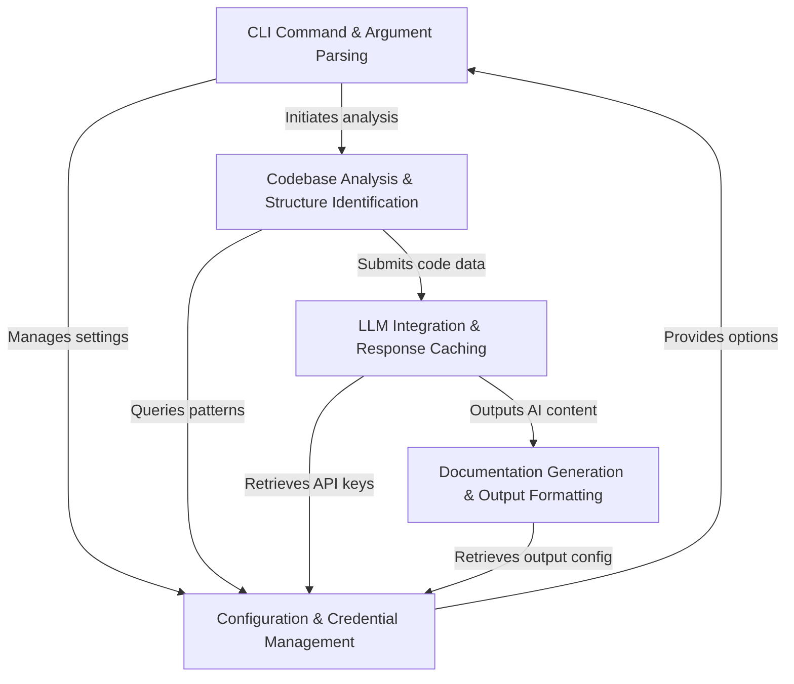
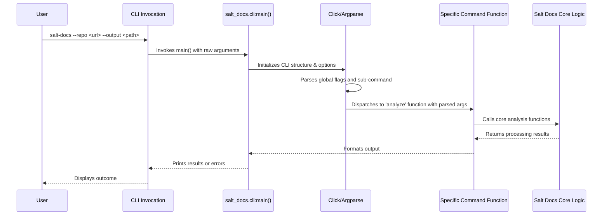
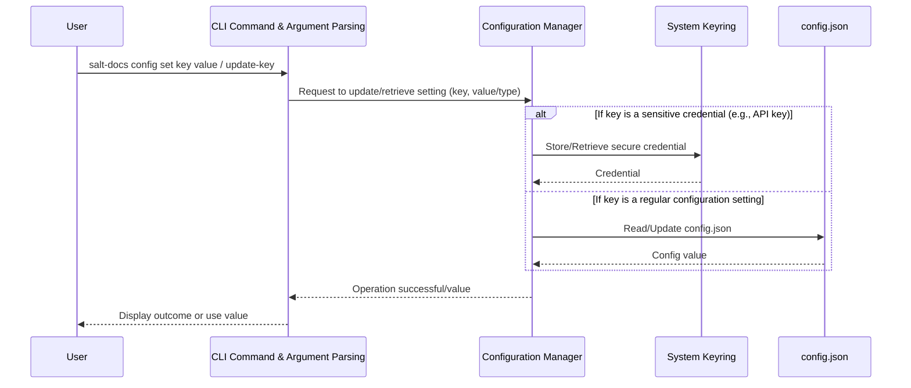
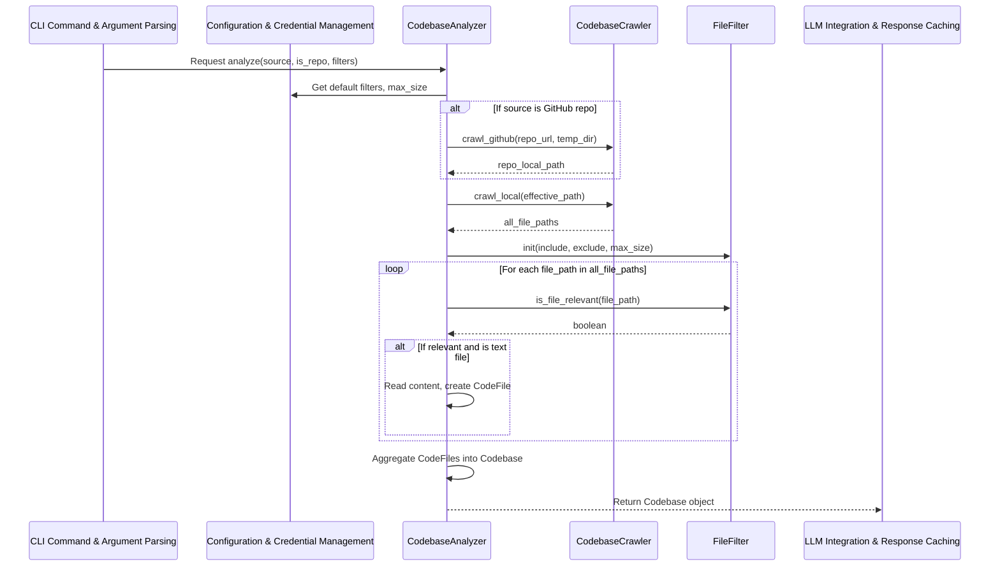
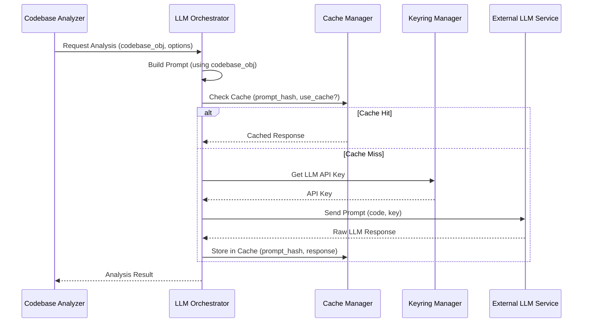
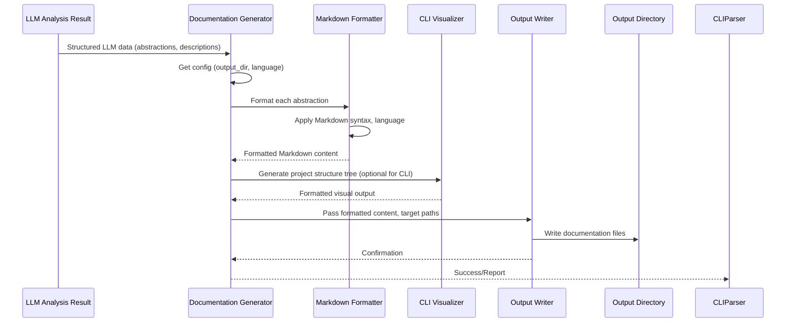

# salt-docs-cli

The `salt-docs-cli` project is an **AI-powered command-line interface** designed for *automating documentation generation* from codebases. Its core purpose is to analyze specified GitHub repositories or local directories, identify key abstractions, and generate user-friendly documentation in various formats and languages. The architecture is **CLI-driven**, leveraging *Google Gemini AI* for intelligent content creation, supported by a robust configuration management system that includes secure keyring storage for sensitive credentials like API keys.

Key functionalities include an *interactive setup wizard* (`init`), comprehensive configuration management (`config`) for settings like output directories, language, and file filtering patterns, and the primary documentation generation commands (`--repo`, `--dir`). The system performs initial **codebase crawling and structural analysis**, preparing data for the Large Language Model. To optimize performance and reduce API costs, it incorporates an *efficient caching mechanism* for LLM responses. Finally, it ensures a *consistent and visually appealing output* through structured formatting, colorized terminal feedback, and multi-language support, transforming raw AI output into well-organized documentation artifacts.


**Source Repository:** [None](None)



## Chapters

1. [CLI Command & Argument Parsing](01_cli_command___argument_parsing_.md)
2. [Configuration & Credential Management](02_configuration___credential_management_.md)
3. [Codebase Analysis & Structure Identification](03_codebase_analysis___structure_identification_.md)
4. [LLM Integration & Response Caching](04_llm_integration___response_caching_.md)
5. [Documentation Generation & Output Formatting](05_documentation_generation___output_formatting_.md)


---

## Chapter 1: CLI Command & Argument Parsing

### Purpose and Core Responsibilities

The `CLI Command & Argument Parsing` component serves as the gateway for users to interact with the Salt Docs CLI. Its primary purpose is to translate human-readable commands and arguments typed into a terminal into structured, actionable instructions for the application's core logic.

Without this abstraction, users would need to manually call Python functions with hardcoded parameters, leading to a cumbersome and error-prone experience. This component solves the problem of providing a user-friendly, consistent, and robust command-line interface.

Its core responsibilities include:
*   **Interpreting User Input**: Receiving raw strings from the command line and identifying the intended command and its associated parameters.
*   **Argument and Option Parsing**: Extracting values for required arguments and optional flags (e.g., `--repo`, `-o`, `--language`).
*   **Command Routing**: Directing control to the appropriate sub-commands or core functionalities such as `init` (initial setup), `config` (configuration management), or the main analysis functions (`--repo`, `--dir`).
*   **Input Validation**: Ensuring that arguments are provided correctly, that mutually exclusive options are not used together, and that values conform to expected types or formats.
*   **Default Application**: Applying default values for options when not explicitly provided by the user, often retrieved from the [Configuration & Credential Management](02_configuration___credential_management_.md) component.

### How it Works

This component functions as the front-end of the Salt Docs CLI, orchestrating the initial stages of user interaction. When a user executes a `salt-docs` command, this component takes over, performing the following key steps:

1.  **Input Capture**: The raw command-line string (e.g., `salt-docs --repo <url> --output <path>`) is captured by the operating system and passed to the `salt-docs` entry point.
2.  **Command Identification**: It first determines the primary command being invoked (e.g., `init`, `config`, or a global action like `--repo`/`--dir`).
3.  **Argument Extraction**: It then extracts all associated arguments, flags, and their values. For example, from `--output /custom/path`, it identifies `output` as a flag and `/custom/path` as its value.
4.  **Validation**: Basic validation occurs immediately, checking for required arguments, correct syntax, and conflicts between options (e.g., ensuring `--repo` and `--dir` are not used simultaneously).
5.  **Data Packaging**: The parsed and validated information is encapsulated into a structured format (e.g., a dictionary or object) that can be easily consumed by downstream components.
6.  **Dispatch**: Finally, it routes control to the specific handler function responsible for executing the identified command, passing the packaged arguments.

This component integrates tightly with the [Configuration & Credential Management](02_configuration___credential_management_.md) component to fetch default settings (like `output_dir` or `language`) when options are omitted by the user, and to update settings when `salt-docs config set` commands are issued. It also works with [Documentation Generation & Output Formatting](05_documentation_generation___output_formatting_.md) to display help messages, error feedback, and interactive prompts.

### Internal Implementation

The Salt Docs CLI leverages a robust Python library, likely `Click` or `argparse`, to manage its command structure and argument parsing efficiently. The `setup.py` file defines the `salt-docs` command's entry point, pointing to a `main` function within the `salt_docs.cli` module.

#### High-Level Workflow

The interaction from user input to core logic can be visualized as follows:



#### Code Walkthrough

The foundation of the CLI is established in `setup.py`, which defines the console script.

##### 1. Entry Point Definition (`setup.py`)

```python
# setup.py (simplified)
from setuptools import setup, find_packages

setup(
    name="salt-docs",
    # ... other metadata ...
    entry_points={
        "console_scripts": [
            "salt-docs=salt_docs.cli:main", # Maps 'salt-docs' to the main function
        ],
    },
    # ...
)
```
**Explanation**: This snippet from `setup.py` is crucial. It tells the system that after installation, typing `salt-docs` in the terminal should execute the `main()` function located within the `salt_docs.cli` module. This is the very first step in how the CLI tool is launched.

##### 2. Main CLI Structure (`salt_docs/cli.py`)

The `salt_docs/cli.py` module is where the main command group and global options are defined. Given the project's features like improved help and interactive wizards, a library like `Click` is likely used for defining the command structure.

```python
# salt_docs/cli.py (conceptual using Click)
import click
from salt_docs import config_commands # Import sub-command group
from salt_docs import init_logic # For 'init' command

@click.group()
@click.option('--no-cache', is_flag=True, help='Disable LLM response caching.')
@click.option('--max-abstractions', type=int, default=10, help='Max abstractions to identify.')
def main(no_cache, max_abstractions):
    """
    Salt Docs CLI: AI-powered codebase analysis and documentation generation.
    """
    click.echo(f"Caching: {not no_cache}, Max Abstractions: {max_abstractions}")
    pass # Global options are processed here

@main.command()
@click.option('--repo', help='GitHub repository URL.')
@click.option('--dir', help='Local directory path.')
def analyze(repo, dir):
    """Analyze a codebase and generate documentation."""
    if repo and dir:
        click.echo("Error: --repo and --dir are mutually exclusive.", err=True)
        return
    # Delegate to core analysis logic (not shown)
    click.echo(f"Analyzing {'repo' if repo else 'dir'}: {repo or dir}")

@main.command()
def init():
    """Run the initial setup wizard."""
    init_logic.run_wizard() # Delegates to init logic
    click.echo("Initial setup complete!")

main.add_command(config_commands.config) # Register the 'config' sub-group
```
**Explanation**:
*   `@click.group()` defines the top-level `salt-docs` command.
*   `@click.option()` decorators define global options like `--no-cache` and `--max-abstractions`. These options are available across all commands.
*   `@main.command()` registers sub-commands like `analyze` and `init`. The `analyze` command is designed to handle the `--repo` or `--dir` options for documentation generation.
*   The `main.add_command(config_commands.config)` line demonstrates how sub-command groups, like `salt-docs config`, can be organized in separate Python modules (`config_commands.py`) for better code organization and modularity. This promotes a clean separation of concerns for [Configuration & Credential Management](02_configuration___credential_management_.md).

##### 3. Sub-Command Definition (`salt_docs/config_commands.py`)

The `config` sub-command, along with its own sub-commands (e.g., `show`, `set`), would be defined in a dedicated module.

```python
# salt_docs/config_commands.py (conceptual using Click)
import click
from salt_docs import config_manager # For config logic

@click.group()
def config():
    """Manage Salt Docs configuration."""
    pass # No operation, just a group

@config.command('show')
def show_config():
    """Display current configuration."""
    config_manager.display_current_config() # Delegates to config manager
    click.echo("Config displayed.")

@config.command('set')
@click.argument('key')
@click.argument('value')
def set_config(key, value):
    """Set a configuration option."""
    config_manager.update_setting(key, value) # Delegates to config manager
    click.echo(f"Set '{key}' to '{value}'.")
```
**Explanation**:
*   `@click.group()` again defines `config` as a sub-group under `main`.
*   `@config.command('show')` and `@config.command('set')` define specific actions under `salt-docs config`.
*   `@click.argument('key')` and `@click.argument('value')` specify positional arguments for the `set` command.
*   These commands then delegate to the [Configuration & Credential Management](02_configuration___credential_management_.md) component for the actual logic of displaying or updating settings.

##### 4. Argument Validation

Beyond the basic parsing provided by `Click`, application-specific validation ensures robust user input.

```python
# salt_docs/cli.py (validation example within command)
import click

@click.group()
def main():
    pass

@main.command()
@click.option('--repo', help='GitHub repository URL.')
@click.option('--dir', help='Local directory path.')
def analyze(repo, dir):
    if repo and dir:
        click.echo("Error: --repo and --dir are mutually exclusive. Please provide only one.", err=True)
        return
    if not (repo or dir):
        click.echo("Error: Either --repo or --dir must be provided.", err=True)
        return
    # If validation passes, proceed with analysis
    click.echo(f"Starting analysis for: {repo or dir}")
```
**Explanation**: This snippet shows how to implement custom validation logic directly within a command function. It checks for mutually exclusive options (`--repo` and `--dir`) and ensures that at least one of the required source options is provided. If validation fails, an error message is printed to `stderr`, and the command exits gracefully.

### Usage Examples

The `CLI Command & Argument Parsing` component handles all forms of user interaction via the command line.

**Initial Setup Wizard:**
```bash
salt-docs init
```
This command invokes the `init` sub-command, which guides the user through the first-time setup process, configuring API keys and default preferences via interactive prompts.

**Analyzing a GitHub Repository:**
```bash
salt-docs --repo https://github.com/username/repo --output ./my-docs --language english
```
Here, the component parses the `--repo` argument to identify the source codebase, `--output` for the destination directory, and `--language` to specify the output format.

**Managing Configuration:**
```bash
salt-docs config show
salt-docs config set max_abstractions 15
```
These commands demonstrate interaction with the `config` sub-group. `config show` displays current settings, while `config set` modifies a specific configuration option, which is then handled by the [Configuration & Credential Management](02_configuration___credential_management_.md) component.

### Key Takeaways

The `CLI Command & Argument Parsing` component is the foundation of the Salt Docs CLI's usability.
*   It is responsible for **interpreting raw command-line input** from users, parsing it into structured commands and options.
*   It provides the **primary interface** for users to interact with the system, enabling access to functionalities like `init`, `config` management, and codebase analysis via `--repo` or `--dir`.
*   It performs **essential validation** to ensure correct command execution and robust input handling.
*   It **integrates seamlessly** with the [Configuration & Credential Management](02_configuration___credential_management_.md) component for defaults and updates, and with core logic for execution, providing a cohesive user experience.

This component ensures that every user command is correctly understood and routed, forming a reliable and intuitive entry point to the Salt Docs CLI's powerful features.

[Next Chapter: Configuration & Credential Management](02_configuration___credential_management_.md)

---

## Chapter 2: Configuration & Credential Management

This chapter delves into the mechanisms Salt Docs CLI employs for managing persistent settings and sensitive information, building upon the user interactions initiated by the [CLI Command & Argument Parsing](01_cli_command___argument_parsing_.md) component.

### Purpose and Core Responsibilities

The `Configuration & Credential Management` component is essential for providing a seamless and secure user experience. Without it, users would constantly need to re-enter preferences and sensitive API keys, leading to frustration and potential security risks. This component solves the critical problems of persistent storage, secure credential handling, and easy management of application settings.

Its core responsibilities include:

*   **Persistent Storage**: Storing user preferences such as output directories, language settings, file patterns, and caching preferences in a durable, file-based format.
*   **Secure Credential Management**: Safely storing sensitive information like API keys (e.g., Google Gemini) and personal access tokens (e.g., GitHub) using the operating system's native secure keyring services. This prevents credentials from being stored in plain text on the file system.
*   **Retrieval and Provisioning**: Making stored configuration settings and credentials readily available to other components of the Salt Docs CLI as needed.
*   **Updating and Deletion**: Providing mechanisms to update existing settings and credentials, and implicitly, to remove them (by setting to an empty value or overwriting).
*   **CLI Integration**: Offering dedicated command-line interface commands (`salt-docs config`) for users to interactively or programmatically manage their settings.

### How it Works

This component acts as the central repository for all application-wide settings and sensitive user data. It strategically separates non-sensitive configuration from sensitive credentials to apply the most appropriate storage mechanism for each.

1.  **Request from CLI**: When a user runs a `salt-docs` command, the [CLI Command & Argument Parsing](01_cli_command___argument_parsing_.md) component first checks if specific options are provided. If not, it requests default values from this `Configuration & Credential Management` component.
2.  **Configuration File Handling**: For general preferences (e.g., `output_dir`, `language`, `use_cache`), a designated `config.json` file is read from or written to. This file typically resides in a user-specific, hidden directory.
3.  **System Keyring Interaction**: For sensitive data (API keys, tokens), the component interacts with the operating system's secure keyring service. This leverages platform-specific security features (e.g., macOS Keychain, Windows Credential Manager, Linux Secret Service) to store credentials encrypted and isolated from regular files.
4.  **Data Provisioning**: Once retrieved, the configuration settings and credentials are provided to the requesting component (e.g., [LLM Integration & Response Caching](04_llm_integration___response_caching_.md) for API keys, or [Documentation Generation & Output Formatting](05_documentation_generation___output_formatting_.md) for output preferences).
5.  **Update Handling**: When `salt-docs config set` or `salt-docs config update-*` commands are executed, this component is responsible for validating the input and persisting the changes to the correct storage (either `config.json` or the system keyring).

### Internal Implementation

The `Configuration & Credential Management` component leverages Python's `json` module for file-based configuration and the `keyring` library for secure credential storage.

#### High-Level Workflow

The interaction between the CLI and the configuration system can be visualized as follows:



#### Key Concepts

*   **`config.json`**: This JSON file stores non-sensitive user preferences. Its structure allows for easy serialization and deserialization of settings. The file's location is determined dynamically to be user-specific and platform-independent.
*   **System Keyring**: This is a secure storage mechanism provided by the operating system. It's used for highly sensitive data like API keys and tokens. The `keyring` Python library provides a cross-platform interface to interact with these services. Each entry is typically identified by a `service_name` and a `username`.

#### Code Walkthrough

The configuration logic is primarily managed by a `ConfigManager` and a `KeyringManager`, with utility functions for determining file paths.

##### 1. Configuration File Path (`salt_docs/utils/paths.py`)

A utility function ensures that the `config.json` file is stored in a consistent, user-specific location, often within a dedicated application directory.

```python
# salt_docs/utils/paths.py (simplified)
from pathlib import Path
import os

def get_base_config_dir() -> Path:
    """Returns the base directory for Salt Docs configuration."""
    home_dir = Path.home()
    # Default path: ~/Documents/Salt Docs/.salt
    return home_dir / "Documents" / "Salt Docs" / ".salt"

def get_config_filepath() -> Path:
    """Returns the full path to the configuration JSON file."""
    return get_base_config_dir() / "config.json"
```
**Explanation**: This snippet defines how the application determines the canonical location for its `config.json` file. It constructs a platform-independent path, typically within the user's home directory. The `get_base_config_dir()` function ensures that the parent directory exists before attempting to create or access the `config.json` file.

##### 2. Configuration Manager (`salt_docs/config_manager.py`)

The `ConfigManager` class handles all operations related to the `config.json` file, including loading, saving, and managing individual settings.

```python
# salt_docs/config_manager.py (simplified)
import json
from pathlib import Path
from salt_docs.utils.paths import get_config_filepath # Path utility

class ConfigManager:
    _config = None # Cache for loaded config
    _filepath = get_config_filepath()

    @classmethod
    def _load_config(cls) -> dict:
        """Loads configuration from the JSON file."""
        if not cls._filepath.exists():
            cls._filepath.parent.mkdir(parents=True, exist_ok=True)
            return {} # Return empty config if file doesn't exist
        with open(cls._filepath, 'r', encoding='utf-8') as f:
            return json.load(f)

    @classmethod
    def get_setting(cls, key: str, default=None):
        """Retrieves a configuration setting."""
        if cls._config is None:
            cls._config = cls._load_config()
        return cls._config.get(key, default)

    @classmethod
    def set_setting(cls, key: str, value):
        """Sets and persists a configuration setting."""
        if cls._config is None:
            cls._config = cls._load_config()
        cls._config[key] = value
        with open(cls._filepath, 'w', encoding='utf-8') as f:
            json.dump(cls._config, f, indent=4)
        return True
```
**Explanation**: The `ConfigManager` provides class methods to interact with the `config.json` file. It includes a caching mechanism (`_config`) to avoid repeatedly reading the file. The `_load_config` method ensures the configuration directory exists. `get_setting` retrieves a value, while `set_setting` updates a value in memory and immediately writes the entire configuration back to the file, ensuring persistence.

##### 3. Keyring Manager (`salt_docs/keyring_manager.py`)

The `KeyringManager` handles all interactions with the operating system's secure keyring.

```python
# salt_docs/keyring_manager.py (simplified)
import keyring

class KeyringManager:
    SERVICE_ID_GEMINI = "salt-docs-gemini-api-key"
    SERVICE_ID_GITHUB = "salt-docs-github-token"
    USERNAME = "salt-docs-user" # A generic username for keyring entries

    @classmethod
    def get_gemini_api_key(cls) -> str | None:
        """Retrieves the Gemini API key from the keyring."""
        return keyring.get_password(cls.SERVICE_ID_GEMINI, cls.USERNAME)

    @classmethod
    def set_gemini_api_key(cls, api_key: str):
        """Stores the Gemini API key in the keyring."""
        keyring.set_password(cls.SERVICE_ID_GEMINI, cls.USERNAME, api_key)

    @classmethod
    def get_github_token(cls) -> str | None:
        """Retrieves the GitHub token from the keyring."""
        return keyring.get_password(cls.SERVICE_ID_GITHUB, cls.USERNAME)

    @classmethod
    def set_github_token(cls, token: str):
        """Stores the GitHub token in the keyring."""
        keyring.set_password(cls.SERVICE_ID_GITHUB, cls.USERNAME, token)
```
**Explanation**: This `KeyringManager` class provides a simple interface to the `keyring` library. It defines specific `SERVICE_ID` constants for the Gemini API key and GitHub token, ensuring these credentials are stored and retrieved consistently. The `get_*` methods fetch credentials securely, while `set_*` methods store them, leveraging the underlying OS-specific keyring implementation.

##### 4. Integration with CLI Commands (`salt_docs/config_commands.py`)

The `config` sub-command group (introduced in [Chapter 1: CLI Command & Argument Parsing](01_cli_command___argument_parsing_.md)) directly interacts with the `ConfigManager` and `KeyringManager` to perform its actions.

```python
# salt_docs/config_commands.py (excerpt, building on Chapter 1)
import click
from salt_docs.config_manager import ConfigManager
from salt_docs.keyring_manager import KeyringManager

@click.group()
def config():
    """Manage Salt Docs configuration."""
    pass # This group simply organizes sub-commands

@config.command('show')
def show_config():
    """Display current configuration."""
    # Example: displaying a config.json setting and keyring status
    click.echo(f"Output Directory: {ConfigManager.get_setting('output_dir', 'N/A')}")
    click.echo(f"LLM Caching Enabled: {ConfigManager.get_setting('use_cache', True)}")
    click.echo(f"Gemini API Key set: {'Yes' if KeyringManager.get_gemini_api_key() else 'No'}")

@config.command('set')
@click.argument('key')
@click.argument('value')
def set_config(key, value):
    """Set a configuration option."""
    ConfigManager.set_setting(key, value) # Delegates to ConfigManager
    click.echo(f"Set '{key}' to '{value}'.")

@config.command('update-gemini-key')
@click.argument('api_key', required=False)
def update_gemini_key(api_key):
    """Update Gemini API key (interactively if no key provided)."""
    if not api_key:
        api_key = click.prompt("Enter your Gemini API key", hide_input=True)
    KeyringManager.set_gemini_api_key(api_key) # Delegates to KeyringManager
    click.echo("Gemini API key updated securely.")
```
**Explanation**: This code demonstrates how the `config` CLI commands leverage the `ConfigManager` and `KeyringManager`. The `show_config` command retrieves both file-based settings and checks for the presence of keyring-stored credentials. The `set_config` command directly calls `ConfigManager.set_setting` to update preferences, and `update-gemini-key` uses `KeyringManager.set_gemini_api_key`, incorporating an interactive prompt with masked input for security.

### Usage Examples

The `Configuration & Credential Management` component exposes its functionality through the `salt-docs config` CLI commands.

**View Current Configuration:**
```bash
salt-docs config show
```
This command displays all currently saved settings from `config.json` and indicates whether sensitive credentials are set in the system keyring.

**Update a Configuration Setting:**
```bash
salt-docs config set max_abstractions 15
salt-docs config set use_cache false
salt-docs config set output_dir /custom/path/for/docs
```
These commands directly modify non-sensitive settings, persisting them to the `config.json` file. The changes will be effective for subsequent `salt-docs` runs.

**Update Sensitive Credentials (Interactive):**
```bash
salt-docs config update-gemini-key
salt-docs config update-github-token
```
These commands prompt the user to enter their API key or token, securely storing it in the system keyring using masked input.

**Update Sensitive Credentials (Programmatically):**
```bash
salt-docs config update-gemini-key "YOUR_GEMINI_API_KEY_HERE"
salt-docs config update-github-token "YOUR_GITHUB_TOKEN_HERE"
```
While less secure due to exposing the key/token in command history, this option allows programmatic updating, suitable for automated environments where the key/token is securely supplied.

### Key Takeaways

The `Configuration & Credential Management` component is vital for Salt Docs CLI's functionality and user experience.
*   It handles the **persistent storage** of user preferences in a `config.json` file.
*   It ensures the **secure management** of sensitive credentials (API keys, tokens) by utilizing the operating system's native keyring services.
*   It provides a **user-friendly CLI interface** for viewing and modifying these settings (`salt-docs config`).
*   It acts as a **centralized source** for default values and essential credentials consumed by other components, such as [LLM Integration & Response Caching](04_llm_integration___response_caching_.md) and [Documentation Generation & Output Formatting](05_documentation_generation___output_formatting_.md).

This component underpins the application's ability to maintain state across sessions, personalize user experience, and handle sensitive data responsibly.

[Next Chapter: Codebase Analysis & Structure Identification](03_codebase_analysis___structure_identification_.md)

---

## Chapter 3: Codebase Analysis & Structure Identification

This chapter details the foundational component responsible for understanding a codebase, building upon the user input and configurations established by [CLI Command & Argument Parsing](01_cli_command___argument_parsing_.md) and [Configuration & Credential Management](02_configuration___credential_management_.md).

### Purpose and Core Responsibilities

The `Codebase Analysis & Structure Identification` component is a critical initial abstraction in the Salt Docs CLI workflow. Its primary purpose is to transform a raw collection of files (from a local directory or a GitHub repository) into a structured, filtered, and comprehensible representation suitable for subsequent AI processing.

Without this component, the LLM would be fed an unmanageable volume of unorganized data, leading to irrelevant documentation, excessive processing time, and high costs. This component solves the problem of efficiently acquiring, sifting through, and structuring codebase information.

Its core responsibilities include:

*   **File System Crawling**: Accessing and traversing specified file systems, whether a local directory or a remote GitHub repository.
*   **Intelligent File Filtering**: Applying include/exclude patterns and size limits to focus on relevant source code and documentation files, discarding binaries, build artifacts, and overly large files.
*   **Initial Structural Analysis**: Understanding the basic hierarchy (directories, files), identifying file types, and extracting basic metadata.
*   **Abstraction Identification (Preliminary)**: Performing a rudimentary scan to identify potential high-level abstractions (e.g., major directories, significant files) before deeper LLM analysis.
*   **Data Preparation**: Packaging the filtered and structured codebase information into an easily consumable format for the [LLM Integration & Response Caching](04_llm_integration___response_caching_.md) component.

### How it Works

This component is typically invoked early in the execution flow after [CLI Command & Argument Parsing](01_cli_command___argument_parsing_.md) has identified the source (repo URL or local path) and relevant filters, and [Configuration & Credential Management](02_configuration___credential_management_.md) has provided any default settings.

1.  **Source Identification**: The component receives the codebase source (a GitHub URL or a local file path).
2.  **Codebase Acquisition**:
    *   If a GitHub URL is provided, it initiates a secure clone of the repository into a temporary local directory. Authentication (via GitHub token) is handled by retrieving credentials from [Configuration & Credential Management](02_configuration___credential_management_.md).
    *   If a local directory is provided, it directly begins scanning the specified path.
3.  **File Traversal and Filtering**: It recursively traverses the acquired codebase. For each file encountered, it applies a set of filtering rules:
    *   **Size Limit**: Files exceeding a configurable maximum size (`max_file_size`) are ignored.
    *   **Exclude Patterns**: Files or paths matching specified exclusion patterns (e.g., `*.test.js`, `__pycache__/*`, `node_modules/`) are skipped.
    *   **Include Patterns**: If specific include patterns are provided, only files matching these patterns are considered. If no include patterns are specified, all files not explicitly excluded are included by default.
    These patterns are often sourced from both CLI arguments (`--include`, `--exclude`) and default settings in [Configuration & Credential Management](02_configuration___credential_management_.md).
4.  **Content Reading & Structuring**: For each relevant file, its content is read (assuming it's a text file) and stored alongside its path and basic metadata (e.g., size, detected language).
5.  **Codebase Representation**: All filtered files and their contents are aggregated into an internal data structure (e.g., a `Codebase` object containing `CodeFile` objects). This structure represents the entire codebase to be analyzed.
6.  **Hand-off to LLM**: This structured `Codebase` object is then passed to the [LLM Integration & Response Caching](04_llm_integration___response_caching_.md) component, ready for deeper AI-powered analysis. Temporary directories created for GitHub repositories are cleaned up.

### Internal Implementation

The `Codebase Analysis & Structure Identification` component is composed of several modules that work together: a `Crawler` for acquiring the source, a `FileFilter` for pattern matching and size checks, and `Models` for representing the codebase data, all orchestrated by a main `CodebaseAnalyzer`.

#### High-Level Workflow

The process of analyzing a codebase from user input to LLM-ready data can be visualized as follows:



#### Key Concepts

*   **`CodebaseCrawler`**: Responsible for obtaining the raw file system data, whether by cloning a Git repository or by traversing a local directory.
*   **`FileFilter`**: Applies the rules (include/exclude patterns, `max_file_size`) to determine which files are relevant for analysis.
*   **`CodeFile` & `Codebase` Models**: Data structures that hold the processed information: `CodeFile` for individual files (path, content, metadata) and `Codebase` as an aggregation of `CodeFile` objects.

#### Code Walkthrough

The core logic resides in `salt_docs/analysis/`.

##### 1. Codebase Crawler (`salt_docs/analysis/crawler.py`)

This module handles the physical acquisition of the codebase.

```python
# salt_docs/analysis/crawler.py (simplified)
from pathlib import Path
import git # Assumed: `pip install GitPython`

class CodebaseCrawler:
    def crawl_local(self, path: Path) -> list[Path]:
        """Recursively lists all files in a local directory."""
        if not path.is_dir():
            raise ValueError(f"Path is not a directory: {path}")
        return [p for p in path.rglob("*") if p.is_file()]

    def crawl_github(self, repo_url: str, temp_dir: Path) -> Path:
        """Clones a GitHub repository into a temporary directory."""
        if not temp_dir.exists():
            temp_dir.mkdir(parents=True)
        # Simplified: actual implementation handles authentication, branch, etc.
        repo_name = repo_url.split('/')[-1].replace('.git', '')
        repo_path = temp_dir / repo_name
        git.Repo.clone_from(repo_url, repo_path)
        return repo_path
```
**Explanation**: The `CodebaseCrawler` class provides methods for crawling. `crawl_local` uses `pathlib.Path.rglob` for efficient traversal of local directories. `crawl_github` leverages the `git` library (specifically `GitPython`) to clone a specified repository into a designated temporary directory, returning the local path to the cloned repository.

##### 2. File Filter (`salt_docs/analysis/filter.py`)

This module implements the logic for including and excluding files based on patterns and size.

```python
# salt_docs/analysis/filter.py (simplified)
import fnmatch
from pathlib import Path

class FileFilter:
    def __init__(self, include: list[str], exclude: list[str], max_size: int):
        self.include_patterns = include
        self.exclude_patterns = exclude
        self.max_file_size = max_size

    def is_file_relevant(self, file_path: Path, root_path: Path) -> bool:
        """Determines if a file should be included based on filters."""
        relative_path = str(file_path.relative_to(root_path))
        
        # 1. Check size limit
        if file_path.stat().st_size > self.max_file_size:
            return False

        # 2. Check exclude patterns (prioritized)
        for pattern in self.exclude_patterns:
            if fnmatch.fnmatch(relative_path, pattern):
                return False
        
        # 3. Check include patterns
        if self.include_patterns:
            for pattern in self.include_patterns:
                if fnmatch.fnmatch(relative_path, pattern):
                    return True
            return False # If include patterns exist, and none matched
        
        return True # No specific include patterns, and no exclude matched
```
**Explanation**: The `FileFilter` initializes with include patterns, exclude patterns, and a maximum file size. Its `is_file_relevant` method applies these rules to a given `file_path`, first checking size, then exclude patterns (which take precedence), and finally include patterns. Paths are converted to `relative_path` to ensure pattern matching works consistently regardless of the absolute root.

##### 3. Codebase Models (`salt_docs/analysis/models.py`)

These data classes provide a structured way to represent files and the entire codebase.

```python
# salt_docs/analysis/models.py
from dataclasses import dataclass, field
from pathlib import Path

@dataclass
class CodeFile:
    """Represents a single source code file within the codebase."""
    path: Path          # Absolute path to the file
    relative_path: Path # Path relative to the codebase root
    content: str = field(repr=False) # File content (hidden from default repr)
    size: int = 0       # Size in bytes
    language: str = "unknown" # Detected programming language

@dataclass
class Codebase:
    """Represents the entire filtered and structured codebase."""
    root_path: Path           # Absolute root path of the codebase
    files: list[CodeFile] = field(default_factory=list) # List of relevant files
    project_name: str = "Unnamed Project" # Derived from root_path/repo_url
```
**Explanation**: `CodeFile` stores essential information about each individual file, including its content. `Codebase` serves as a container for all relevant `CodeFile` instances and the overall `root_path` of the analysis, providing a unified view of the project's structure.

##### 4. Codebase Analyzer Orchestrator (`salt_docs/analysis/orchestrator.py`)

This is the main class that coordinates the crawling, filtering, and structuring.

```python
# salt_docs/analysis/orchestrator.py
from pathlib import Path
from tempfile import TemporaryDirectory
from salt_docs.config_manager import ConfigManager # For defaults
from salt_docs.analysis.crawler import CodebaseCrawler
from salt_docs.analysis.filter import FileFilter
from salt_docs.analysis.models import CodeFile, Codebase

class CodebaseAnalyzer:
    def __init__(self):
        self.crawler = CodebaseCrawler()

    def analyze(self, source_path_str: str, is_repo: bool,
                project_name: str | None = None,
                include_patterns: list[str] | None = None,
                exclude_patterns: list[str] | None = None) -> Codebase:
        """
        Orchestrates codebase crawling, filtering, and structuring.
        """
        # Retrieve default filter settings from Configuration Manager
        config_include = ConfigManager.get_setting('include_patterns', ['*'])
        config_exclude = ConfigManager.get_setting('exclude_patterns', [])
        max_size = ConfigManager.get_setting('max_file_size', 100 * 1024) # Default 100KB

        # Initialize FileFilter with combined CLI and config patterns
        file_filter = FileFilter(
            include=include_patterns or config_include,
            exclude=exclude_patterns or config_exclude,
            max_size=max_size
        )

        root_to_analyze: Path
        temp_dir_obj = None # To manage temporary directory for GitHub clones

        if is_repo:
            temp_dir_obj = TemporaryDirectory()
            root_to_analyze = self.crawler.crawl_github(source_path_str, Path(temp_dir_obj.name))
        else:
            root_to_analyze = Path(source_path_str)
        
        project_name = project_name or root_to_analyze.name # Derive project name

        all_file_paths = self.crawler.crawl_local(root_to_analyze)
        
        filtered_code_files: list[CodeFile] = []
        for file_path in all_file_paths:
            if file_path.is_file() and file_filter.is_file_relevant(file_path, root_to_analyze):
                try:
                    content = file_path.read_text(encoding='utf-8')
                    filtered_code_files.append(
                        CodeFile(
                            path=file_path,
                            relative_path=file_path.relative_to(root_to_analyze),
                            content=content,
                            size=file_path.stat().st_size
                        )
                    )
                except UnicodeDecodeError:
                    # Non-text files (images, binaries) are silently skipped
                    pass 
                except Exception as e:
                    # Log other file reading errors
                    print(f"Error reading {file_path}: {e}")

        codebase = Codebase(root_path=root_to_analyze, 
                            files=filtered_code_files, 
                            project_name=project_name)

        if temp_dir_obj:
            temp_dir_obj.cleanup() # Ensure temporary repo is deleted

        return codebase
```
**Explanation**: The `CodebaseAnalyzer.analyze` method is the entry point for this component. It takes the source path, determines if it's a repository, and retrieves necessary filtering parameters (combining CLI inputs with defaults from [Configuration & Credential Management](02_configuration___credential_management_.md)). It then orchestrates the `CodebaseCrawler` for acquisition, `FileFilter` for selection, reads file contents, and finally constructs a `Codebase` object containing all relevant and processed `CodeFile` instances. Importantly, it manages a `TemporaryDirectory` for GitHub clones, ensuring proper cleanup. The resulting `Codebase` object is the definitive input for the LLM.

### Usage Examples

The `Codebase Analysis & Structure Identification` component operates implicitly when a user initiates an analysis command. Its behavior is primarily controlled through CLI options and configuration settings.

**Analyzing a Local Directory:**
```bash
salt-docs --dir /path/to/my/project
```
In this scenario, the `CodebaseAnalyzer` will use `CodebaseCrawler.crawl_local` to scan `/path/to/my/project`, applying default include/exclude patterns and file size limits from `config.json`.

**Analyzing a GitHub Repository with Custom Filters:**
```bash
salt-docs --repo https://github.com/myorg/myproject --include "*.py" --exclude "tests/*" --max-size 50000
```
Here, the `CodebaseAnalyzer` first clones the GitHub repository. It then filters files, only including `.py` files, excluding anything in a `tests/` directory, and ignoring any file larger than 50,000 bytes (50KB). The GitHub token for authentication would be retrieved from the system keyring via the [Configuration & Credential Management](02_configuration___credential_management_.md) component if the repository is private.

**Overriding Default Max Abstractions (Affects subsequent steps, but relies on this component's output):**
```bash
salt-docs --dir /path/to/project --max-abstractions 5
```
While `max-abstractions` is primarily used by the LLM, the `CodebaseAnalysis` component ensures that the initial file selection is robust enough to support identifying that number of abstractions, and the configured `max_file_size` and `filter_patterns` ensure the LLM receives optimal input.

### Key Takeaways

The `Codebase Analysis & Structure Identification` component is the cornerstone for all subsequent processing in the Salt Docs CLI.

*   It is responsible for **acquiring the raw codebase** (local or remote) and **structuring it** for AI consumption.
*   It performs crucial **intelligent filtering** based on file size and user-defined (or default) include/exclude patterns, significantly reducing noise and improving LLM efficiency.
*   It provides a **standardized, structured representation** (`Codebase` object) of the relevant files and their content, serving as the direct input to the [LLM Integration & Response Caching](04_llm_integration___response_caching_.md) component.
*   It **integrates seamlessly** with [CLI Command & Argument Parsing](01_cli_command___argument_parsing_.md) for input and [Configuration & Credential Management](02_configuration___credential_management_.md) for default settings and credentials (like GitHub tokens), forming a cohesive and efficient initial processing pipeline.

This component ensures that the Salt Docs CLI works with a clean, relevant, and well-organized subset of the codebase, which is essential for generating high-quality and pertinent documentation.

[Next Chapter: LLM Integration & Response Caching](04_llm_integration___response_caching_.md)

---

## Chapter 4: LLM Integration & Response Caching

This chapter details the crucial component responsible for interacting with Large Language Models (LLMs) and efficiently managing their responses, directly building upon the structured codebase data provided by the [Codebase Analysis & Structure Identification](03_codebase_analysis___structure_identification_.md) component and leveraging settings from [Configuration & Credential Management](02_configuration___credential_management_.md).

### Purpose and Core Responsibilities

The `LLM Integration & Response Caching` component serves as the intelligent core of the Salt Docs CLI, transforming raw codebase analysis into meaningful documentation insights. Its primary purpose is to abstract away the complexities of interacting with external LLM services (like Google Gemini) while optimizing performance and cost.

Without this abstraction, every analysis request would incur API costs, introduce significant latency, and require manual management of credentials and prompt construction. This component solves the critical problems of secure, efficient, and cost-effective utilization of AI for documentation generation.

Its core responsibilities include:

*   **Secure API Key Management**: Retrieving and utilizing LLM API keys securely from the system's keyring (via [Configuration & Credential Management](02_configuration___credential_management_.md)).
*   **Prompt Construction**: Dynamically generating effective prompts for the LLM based on the structured codebase information received from [Codebase Analysis & Structure Identification](03_codebase_analysis___structure_identification_.md).
*   **Request Management**: Sending requests to the LLM, including handling API calls, timeouts, and potential retries.
*   **Response Processing**: Parsing and validating responses received from the LLM, extracting the generated documentation or analysis insights.
*   **Response Caching**: Implementing a robust caching mechanism to store LLM responses for previous queries, significantly reducing API calls, improving performance for repeated analyses, and decreasing operational costs.
*   **Cost and Performance Optimization**: Leveraging caching and efficient prompt engineering to ensure LLM interactions are as economical and fast as possible.

### How it Works

This component is activated after the [Codebase Analysis & Structure Identification](03_codebase_analysis___structure_identification_.md) component has successfully processed a codebase into a structured `Codebase` object. It acts as an intermediary, handling all AI-related interactions.

1.  **Input Reception**: It receives a `Codebase` object (containing relevant `CodeFile` instances and metadata) and analysis parameters (e.g., `max_abstractions`, `language`) from the preceding analysis stage.
2.  **Prompt Generation**: Based on the `Codebase` object and analysis parameters, a specific prompt is dynamically constructed. This prompt instructs the LLM on what type of documentation to generate (e.g., "Identify the main abstractions in this Python project and explain their purpose").
3.  **Cache Lookup**: Before making an external API call, the system checks its internal cache. A unique hash is generated from the prompt and relevant parameters. If a matching, valid response exists in the cache, it is immediately returned, bypassing the LLM call. This is controlled by the `use_cache` setting from [Configuration & Credential Management](02_configuration___credential_management_.md) or the `--no-cache` CLI flag (from [CLI Command & Argument Parsing](01_cli_command___argument_parsing_.md)).
4.  **API Key Retrieval**: If a cache miss occurs, the necessary LLM API key (e.g., Google Gemini key) is securely retrieved from the system keyring using the [Configuration & Credential Management](02_configuration___credential_management_.md) component.
5.  **LLM Request**: The constructed prompt is sent to the configured LLM service (e.g., Google Gemini API).
6.  **Response Handling**: The raw response from the LLM is received, parsed, and validated. This may involve extracting specific sections, handling JSON output, or checking for errors from the LLM.
7.  **Cache Storage**: If the LLM interaction was successful and caching is enabled, the processed LLM response is stored in the cache, associated with the prompt's unique hash, for future use.
8.  **Output Provisioning**: The final, processed LLM analysis result (e.g., identified abstractions, documentation snippets) is then passed to the [Documentation Generation & Output Formatting](05_documentation_generation___output_formatting_.md) component.

### Internal Implementation

The `LLM Integration & Response Caching` component is composed of several modules: a `PromptBuilder` for crafting LLM queries, an `LLMClient` for interacting with the external LLM API, and a `CacheManager` for handling response persistence. An orchestrating service ties these together.

#### High-Level Workflow

The interaction from codebase analysis to LLM-processed results can be visualized as follows:



#### Key Concepts

*   **`PromptBuilder`**: Responsible for taking the structured `Codebase` object and other parameters to generate a precisely worded LLM prompt. This involves formatting file contents, structuring questions, and specifying output requirements.
*   **`LLMClient`**: An abstract interface for interacting with various LLM providers (currently Google Gemini). It handles the network communication, API specifics, error handling, and basic parsing of raw LLM responses. It relies on `KeyringManager` for secure API keys.
*   **`CacheManager`**: Manages the persistence and retrieval of LLM responses. It generates unique keys for prompts, stores responses (e.g., in a file-based JSON store), and retrieves them when a match is found. It's configured by `ConfigManager`.

#### Code Walkthrough

The core logic for this component resides primarily in `salt_docs/llm/`.

##### 1. Prompt Builder (`salt_docs/llm/prompt_builder.py`)

This module crafts the instructions for the LLM based on the project's data.

```python
# salt_docs/llm/prompt_builder.py (simplified)
from salt_docs.analysis.models import Codebase

class PromptBuilder:
    @staticmethod
    def build_analysis_prompt(codebase: Codebase, max_abstractions: int) -> str:
        """Constructs a prompt for LLM codebase analysis."""
        prompt_parts = [
            f"Analyze the following project '{codebase.project_name}'.",
            f"Identify the top {max_abstractions} main architectural abstractions (e.g., modules, classes, services).",
            "For each abstraction, provide a brief description of its purpose and key responsibilities."
        ]
        
        # Add relevant file contents to the prompt
        for code_file in codebase.files:
            prompt_parts.append(f"\n--- File: {code_file.relative_path} ---\n{code_file.content}")
        
        return "\n".join(prompt_parts)
```
**Explanation**: The `PromptBuilder` provides static methods to generate specific prompts. `build_analysis_prompt` takes a `Codebase` object and `max_abstractions` (from CLI/config) and constructs a detailed textual prompt, including the project's name, the desired number of abstractions, and the actual content of the relevant code files. This ensures the LLM has all necessary context.

##### 2. LLM Client (`salt_docs/llm/client.py`)

This module handles the actual interaction with the LLM API.

```python
# salt_docs/llm/client.py (simplified)
import google.generativeai as genai
from salt_docs.keyring_manager import KeyringManager # For API keys

class LLMClient:
    def __init__(self):
        self._api_key = KeyringManager.get_gemini_api_key()
        if not self._api_key:
            raise ValueError("Gemini API key not found. Please run 'salt-docs init' or 'salt-docs config update-gemini-key'.")
        genai.configure(api_key=self._api_key)
        self.model = genai.GenerativeModel('gemini-pro')

    def send_request(self, prompt: str) -> str:
        """Sends a prompt to the LLM and returns its response."""
        try:
            response = self.model.generate_content(prompt)
            return response.text
        except Exception as e:
            raise RuntimeError(f"LLM API request failed: {e}")
```
**Explanation**: The `LLMClient` initializes by securely retrieving the Google Gemini API key from the `KeyringManager` (part of [Configuration & Credential Management](02_configuration___credential_management_.md)). It configures the `genai` client and then exposes a `send_request` method that takes a prompt, sends it to the configured Gemini model, and returns the LLM's text response. Error handling is included for API communication failures.

##### 3. Cache Manager (`salt_docs/llm/cache.py`)

This module manages the storage and retrieval of LLM responses.

```python
# salt_docs/llm/cache.py (simplified)
import json
import hashlib
from pathlib import Path
from salt_docs.config_manager import ConfigManager # For cache settings
from salt_docs.utils.paths import get_base_config_dir

class CacheManager:
    def __init__(self):
        cache_dir = get_base_config_dir() / "llm_cache"
        cache_dir.mkdir(parents=True, exist_ok=True)
        self.cache_file = cache_dir / "responses.json"
        self._cache = self._load_cache()

    def _load_cache(self) -> dict:
        """Loads the cache from the JSON file."""
        if self.cache_file.exists():
            with open(self.cache_file, 'r', encoding='utf-8') as f:
                return json.load(f)
        return {}

    def _save_cache(self):
        """Saves the current cache to the JSON file."""
        with open(self.cache_file, 'w', encoding='utf-8') as f:
            json.dump(self._cache, f, indent=4)

    def get_cache_key(self, prompt: str, params: dict) -> str:
        """Generates a unique hash key for a given prompt and parameters."""
        data_str = json.dumps({"prompt": prompt, "params": params}, sort_keys=True)
        return hashlib.sha256(data_str.encode('utf-8')).hexdigest()

    def get_response(self, key: str, use_cache_flag: bool) -> str | None:
        """Retrieves a response from the cache if available and enabled."""
        if not ConfigManager.get_setting('use_cache', True) or not use_cache_flag:
            return None # Caching disabled by config or CLI flag
        return self._cache.get(key)

    def store_response(self, key: str, response: str):
        """Stores a response in the cache."""
        self._cache[key] = response
        self._save_cache()
```
**Explanation**: The `CacheManager` sets up a `llm_cache` directory and `responses.json` file within the application's configuration base directory. It loads the cache on initialization and saves it whenever a new response is stored. `get_cache_key` generates a consistent hash from the prompt and parameters, which serves as the unique identifier. `get_response` checks if caching is enabled (via `use_cache` from [Configuration & Credential Management](02_configuration___credential_management_.md) or the CLI's `--no-cache` flag, which sets `use_cache_flag` to false) and then retrieves the response. `store_response` adds a new entry to the cache and persists it.

##### 4. LLM Orchestrator (`salt_docs/llm/orchestrator.py`)

This class coordinates the prompt building, caching, and LLM communication.

```python
# salt_docs/llm/orchestrator.py (simplified)
from salt_docs.analysis.models import Codebase
from salt_docs.llm.client import LLMClient
from salt_docs.llm.cache import CacheManager
from salt_docs.llm.prompt_builder import PromptBuilder
from salt_docs.config_manager import ConfigManager # For defaults

class LLMOrchestrator:
    def __init__(self):
        self.llm_client = LLMClient()
        self.cache_manager = CacheManager()

    def analyze_codebase_with_llm(self, codebase: Codebase, 
                                 max_abstractions: int,
                                 no_cache_cli_flag: bool = False) -> str:
        """
        Orchestrates LLM interaction, including prompt building and caching.
        """
        prompt = PromptBuilder.build_analysis_prompt(codebase, max_abstractions)
        
        # Parameters used for cache key generation
        cache_params = {"max_abstractions": max_abstractions}
        cache_key = self.cache_manager.get_cache_key(prompt, cache_params)

        # Determine if caching should be used for this request
        use_cache_for_this_request = not no_cache_cli_flag

        llm_response = self.cache_manager.get_response(cache_key, use_cache_for_this_request)

        if llm_response:
            print("INFO: LLM response retrieved from cache.")
            return llm_response
        
        print("INFO: Calling LLM for analysis...")
        llm_response = self.llm_client.send_request(prompt)
        self.cache_manager.store_response(cache_key, llm_response)
        
        return llm_response
```
**Explanation**: The `LLMOrchestrator` is the primary entry point for LLM interactions. It instantiates the `LLMClient` and `CacheManager`. Its `analyze_codebase_with_llm` method first uses `PromptBuilder` to create the prompt. It then generates a cache key and attempts to retrieve a cached response, respecting the `no_cache_cli_flag` (from [CLI Command & Argument Parsing](01_cli_command___argument_parsing_.md)) and the `use_cache` setting from [Configuration & Credential Management](02_configuration___credential_management_.md) (via `CacheManager`). If a cache miss occurs, it calls the `LLMClient` and subsequently stores the new response in the `CacheManager`.

### Usage Examples

The `LLM Integration & Response Caching` component operates implicitly when the user initiates an analysis task. Its behavior is influenced by configuration settings and CLI flags.

**Standard Codebase Analysis (with caching enabled by default):**
```bash
salt-docs --repo https://github.com/username/repo
```
In this common scenario, the `LLMOrchestrator` will construct a prompt based on the repository, check the cache. If a cached response exists, it will be used. Otherwise, an LLM call will be made, and the response cached.

**Disabling Caching for a Specific Run:**
```bash
salt-docs --dir /path/to/my/project --no-cache
```
Here, the `--no-cache` flag (from [CLI Command & Argument Parsing](01_cli_command___argument_parsing_.md)) explicitly disables the cache lookup and storage for this particular execution. The `LLMOrchestrator` will directly call the LLM and will *not* store the response in the cache, even if `use_cache` is `true` in `config.json`.

**Configuring Max Abstractions (influences prompt and cache key):**
```bash
salt-docs --repo https://github.com/myorg/myproject --max-abstractions 5
```
The `--max-abstractions` option (from [CLI Command & Argument Parsing](01_cli_command___argument_parsing_.md)) directly influences the `PromptBuilder` and becomes part of the cache key. A request with `max_abstractions 5` will have a different cache key than one with `max_abstractions 10`.

**Managing LLM API Keys:**
```bash
salt-docs config update-gemini-key
```
This command, handled by [Configuration & Credential Management](02_configuration___credential_management_.md), ensures the `LLMClient` can securely retrieve the necessary credentials for LLM communication. Without a valid key, LLM interactions will fail.

### Key Takeaways

The `LLM Integration & Response Caching` component is foundational for the Salt Docs CLI's intelligent capabilities.
*   It provides the **secure and efficient gateway** for all interactions with external LLM services.
*   It crucially includes a **robust caching mechanism** that significantly boosts performance, reduces latency, and minimizes API costs for repeated or similar queries.
*   It handles the **complexities of prompt construction** and LLM response parsing, abstracting these details from downstream components.
*   It **seamlessly integrates** with [Codebase Analysis & Structure Identification](03_codebase_analysis___structure_identification_.md) for input, and with [Configuration & Credential Management](02_configuration___credential_management_.md) for secure API keys and cache settings, ensuring a cohesive and performant AI-powered workflow.

This component ensures that the Salt Docs CLI can deliver fast, cost-effective, and intelligent documentation generation.

[Next Chapter: Documentation Generation & Output Formatting](05_documentation_generation___output_formatting_.md)

---

## Chapter 5: Documentation Generation & Output Formatting

This chapter details the crucial component responsible for transforming the intelligent insights from the [LLM Integration & Response Caching](04_llm_integration___response_caching_.md) component into user-consumable, well-structured, and visually appealing documentation artifacts.

### Purpose and Core Responsibilities

The `Documentation Generation & Output Formatting` component is the final stage in the Salt Docs CLI's workflow, where raw LLM responses are molded into polished, ready-to-use documentation. Its primary purpose is to bridge the gap between AI-generated content and a human-readable, consistent, and organized output.

Without this abstraction, the valuable insights from the LLM would remain as unstructured text, requiring significant manual effort to format, organize, and integrate into coherent documentation. This component solves the critical problem of automating the final presentation layer, ensuring high-quality, professional, and accessible documentation.

Its core responsibilities include:

*   **Content Transformation**: Taking the parsed LLM-generated analysis (e.g., identified abstractions, their descriptions, code snippets) and converting it into a structured documentation format.
*   **Output Formatting**: Applying specific formatting rules for the chosen output type (e.g., Markdown, plain text), ensuring syntax correctness and readability.
*   **Multi-language Support**: Integrating language settings (retrieved from [Configuration & Credential Management](02_configuration___credential_management_.md)) to generate documentation in the specified language.
*   **File Organization**: Structuring the generated files within the designated output directory, often creating a hierarchical file system that mirrors the project's logical or physical structure.
*   **Visual Enhancements**: Incorporating visual elements such as structured trees (for project hierarchy), descriptive icons, and consistent color schemes to improve user experience and readability, especially in CLI output and Markdown renderings.
*   **Post-processing**: Potentially performing final cleanups, metadata embedding, or index generation.

### How it Works

This component is typically invoked after the [LLM Integration & Response Caching](04_llm_integration___response_caching_.md) component has successfully processed the codebase and returned its analysis in a structured format (e.g., a list of `Abstraction` objects with descriptions and associated files). It then orchestrates the rendering and saving of these insights.

1.  **Input Reception**: It receives a structured result from the LLM (e.g., a `DocumentationPlan` object containing a list of `Abstraction` models, each with a name, description, and relevant files). It also receives parameters like the desired output directory and language, which are sourced from CLI arguments (parsed by [CLI Command & Argument Parsing](01_cli_command___argument_parsing_.md)) or default settings (from [Configuration & Credential Management](02_configuration___credential_management_.md)).
2.  **Formatter Selection**: Based on the desired output format (e.g., Markdown is the primary for `salt-docs-cli`), an appropriate formatter class is instantiated.
3.  **Content Formatting**: Each identified abstraction and its generated description are passed to the formatter. The formatter applies specific rules to convert this information into the target syntax (e.g., Markdown headings, bullet points, code blocks). It may also translate content if multi-language support is active.
4.  **Visual Integration**: For interactive CLI feedback or embedded visual elements in the documentation (like a file tree), dedicated visualizer components are used to generate ASCII art trees, insert appropriate icons, and apply color coding, leveraging libraries like `rich` for rich terminal output.
5.  **File Structuring & Writing**: The component determines the target file paths for each piece of documentation. For example, each major abstraction might get its own Markdown file, or a single comprehensive document is generated. It then writes these formatted contents to the specified `output_dir` (from [Configuration & Credential Management](02_configuration___credential_management_.md)), ensuring directories are created as needed.
6.  **Index and Navigation Generation**: If a multi-file output is created, it might generate an `index.md` or `SUMMARY.md` file to provide a navigable entry point to the generated documentation.

#### High-Level Workflow

The process of generating and formatting documentation from LLM results can be visualized as follows:



### Internal Implementation

The `Documentation Generation & Output Formatting` component relies on several sub-modules to perform its tasks: data models for representing documentation, formatters for converting content, and an orchestrator to manage the entire output process.

#### Key Concepts

*   **`DocContent Models`**: Data structures that represent the refined output from the LLM, ready for formatting (e.g., `AbstractionDoc`, `ProjectOverviewDoc`).
*   **`Formatters`**: Classes (e.g., `MarkdownFormatter`) responsible for taking a `DocContent` model and rendering it into a string of the desired output format.
*   **`Visuals`**: Utility functions or classes (leveraging libraries like `rich`) for generating structured, colorized, and iconic terminal output (e.g., for `init` wizard or progress displays) or for embedding visual elements into the documentation itself.
*   **`OutputWriter`**: Handles the physical writing of files to the specified output directory, including creating necessary subdirectories.
*   **`DocGenerator`**: The main orchestrator that ties all these sub-components together, managing the overall flow from LLM input to final output files.

#### Code Walkthrough

The core logic for this component typically resides in `salt_docs/docs/`.

##### 1. Documentation Content Models (`salt_docs/docs/models.py`)

These dataclasses define the structure of the documentation that will be generated from the LLM's output.

```python
# salt_docs/docs/models.py (simplified)
from dataclasses import dataclass, field
from pathlib import Path

@dataclass
class AbstractionDoc:
    """Represents a single documented abstraction."""
    name: str
    description: str
    relative_files: list[Path] = field(default_factory=list)

@dataclass
class DocumentationPlan:
    """The complete plan for documentation generation."""
    project_name: str
    overview: str
    abstractions: list[AbstractionDoc] = field(default_factory=list)
```
**Explanation**: `AbstractionDoc` holds the name, LLM-generated description, and associated files for a single codebase abstraction. `DocumentationPlan` aggregates these, along with a project overview, to form the complete structured input for the `DocGenerator`.

##### 2. Markdown Formatter (`salt_docs/docs/formatters/markdown.py`)

This class defines how the structured documentation models are converted into Markdown strings.

```python
# salt_docs/docs/formatters/markdown.py (simplified)
from salt_docs.docs.models import AbstractionDoc, DocumentationPlan

class MarkdownFormatter:
    def format_overview(self, doc_plan: DocumentationPlan) -> str:
        """Formats the project overview into Markdown."""
        return f"# Project: {doc_plan.project_name}\n\n{doc_plan.overview}\n"

    def format_abstraction(self, abstraction: AbstractionDoc) -> str:
        """Formats a single abstraction into Markdown."""
        content = f"## {abstraction.name}\n\n"
        content += f"{abstraction.description}\n\n"
        if abstraction.relative_files:
            content += "### Relevant Files\n"
            for file in abstraction.relative_files:
                content += f"- `{file}`\n"
        return content
```
**Explanation**: The `MarkdownFormatter` provides methods to convert `DocumentationPlan` and `AbstractionDoc` objects into Markdown strings. `format_overview` generates the main project heading and overview, while `format_abstraction` creates sub-headings, descriptions, and a bulleted list of associated files for each abstraction.

##### 3. Visuals & CLI Output (`salt_docs/cli/visuals.py`)

This module contains utilities for enhancing CLI output with visual elements.

```python
# salt_docs/cli/visuals.py (simplified example using rich)
from rich.console import Console
from rich.tree import Tree
from rich.text import Text

console = Console()

def display_project_tree(project_name: str, files: list[str]):
    """Displays a simplified project file tree in the console."""
    tree = Tree(f"[bold green]{project_name}[/bold green]", guide_style="bold bright_blue")
    
    # Simplified: In a real scenario, this would build a hierarchical tree
    for file_path in files[:5]: # Show first 5 files as example
        tree.add(Text(file_path, style="dim"))
    
    console.print(tree)

def display_success_message(message: str):
    """Displays a stylized success message."""
    console.print(f"[bold green]✔[/bold green] {message}")
```
**Explanation**: This (simplified) `visuals` module, often used by the `CLI Command & Argument Parsing` component, uses the `rich` library to create engaging terminal output. `display_project_tree` can render a file hierarchy, and `display_success_message` provides clear, colorized feedback to the user. These visual elements are crucial for a user-friendly CLI experience as mentioned in `CHANGELOG.md` ("Enhanced init mode with structured tree-based visual design").

##### 4. Output Writer (`salt_docs/docs/writer.py`)

This module is responsible for the physical writing of formatted content to the file system.

```python
# salt_docs/docs/writer.py (simplified)
from pathlib import Path

class OutputWriter:
    def __init__(self, output_dir: Path):
        self.output_dir = output_dir
        self.output_dir.mkdir(parents=True, exist_ok=True)

    def write_file(self, filename: str, content: str):
        """Writes content to a file within the output directory."""
        file_path = self.output_dir / filename
        with open(file_path, 'w', encoding='utf-8') as f:
            f.write(content)
        print(f"INFO: Generated {file_path}")
```
**Explanation**: The `OutputWriter` ensures the target `output_dir` exists and provides a `write_file` method to save content to a specified filename within that directory. This abstracts away the file system operations from the `DocGenerator`.

##### 5. Documentation Generator Orchestrator (`salt_docs/docs/generator.py`)

This is the main class that coordinates the formatting and writing processes.

```python
# salt_docs/docs/generator.py (simplified)
from pathlib import Path
from salt_docs.docs.models import DocumentationPlan
from salt_docs.docs.formatters.markdown import MarkdownFormatter
from salt_docs.docs.writer import OutputWriter
from salt_docs.config_manager import ConfigManager # For output_dir

class DocGenerator:
    def __init__(self):
        # Default output directory from configuration
        output_dir_str = ConfigManager.get_setting('output_dir', str(Path.home() / "Documents" / "Salt Docs"))
        self.output_dir = Path(output_dir_str)
        self.formatter = MarkdownFormatter()
        self.writer = OutputWriter(self.output_dir)

    def generate_documentation(self, doc_plan: DocumentationPlan):
        """Generates and writes documentation files."""
        # Generate project overview document
        overview_content = self.formatter.format_overview(doc_plan)
        self.writer.write_file("README.md", overview_content)

        # Generate separate files for each abstraction
        for abstraction in doc_plan.abstractions:
            abstraction_content = self.formatter.format_abstraction(abstraction)
            filename = f"{abstraction.name.replace(' ', '_').lower()}.md"
            self.writer.write_file(f"abstractions/{filename}", abstraction_content)
        
        print(f"INFO: Documentation generated in: {self.output_dir}")
```
**Explanation**: The `DocGenerator` orchestrates the entire process. It initializes with the output directory (retrieved from [Configuration & Credential Management](02_configuration___credential_management_.md)), a `MarkdownFormatter`, and an `OutputWriter`. Its `generate_documentation` method takes the `DocumentationPlan`, uses the formatter to convert it into Markdown, and then uses the writer to save the main `README.md` and individual abstraction files in an `abstractions/` subdirectory.

### Usage Examples

The `Documentation Generation & Output Formatting` component is implicitly used when a user runs the main `salt-docs` analysis command. Its behavior is primarily configured via CLI options and persisted settings.

**Generating Documentation for a Repository (Default Settings):**
```bash
salt-docs --repo https://github.com/username/repo
```
In this scenario, the `DocGenerator` will use the `output_dir` and `language` settings from `config.json` (managed by [Configuration & Credential Management](02_configuration___credential_management_.md)). The LLM's output will be formatted into Markdown, and files will be organized into the default `~/Documents/Salt Docs` directory.

**Generating Documentation with a Custom Output Directory:**
```bash
salt-docs --dir /path/to/my/code --output ./my_project_docs
```
Here, the `--output` flag (parsed by [CLI Command & Argument Parsing](01_cli_command___argument_parsing_.md)) overrides the default `output_dir` config. The documentation will be generated into the newly specified `./my_project_docs` directory relative to the current working directory.

**Generated Output Structure Example:**

After running `salt-docs --dir /my/project`, the `~/Documents/Salt Docs/my_project` (or custom output directory) might look like this:

```
my_project/
├── README.md
└── abstractions/
    ├── cli_command_parser.md
    ├── config_manager.md
    ├── codebase_analyzer.md
    └── llm_orchestrator.md
```
*   `README.md` contains the overall project overview generated by the LLM.
*   Each file in `abstractions/` contains the detailed documentation for a specific codebase abstraction identified by the LLM, formatted as Markdown.

The content of `cli_command_parser.md` could be:

```markdown
## CLI Command Parser

This abstraction is responsible for interpreting user input from the command line,
parsing arguments and options, and routing commands to the appropriate handlers.
It acts as the primary interface for users to interact with the Salt Docs CLI.

### Relevant Files
- `salt_docs/cli/main.py`
- `salt_docs/cli/commands.py`
- `salt_docs/utils/arguments.py`
```
This demonstrates the transformation of raw LLM output into a clean, structured Markdown file.

### Key Takeaways

The `Documentation Generation & Output Formatting` component is the final, crucial step in delivering value from the Salt Docs CLI.
*   It is responsible for **transforming raw LLM analysis** into polished, human-consumable documentation.
*   It handles **flexible output formatting** (primarily Markdown) and ensures **multi-language support**.
*   It ensures **consistent visual presentation** through structured file organization, terminal visuals, and embedded elements.
*   It **integrates seamlessly** with [LLM Integration & Response Caching](04_llm_integration___response_caching_.md) for content, and with [Configuration & Credential Management](02_configuration___credential_management_.md) and [CLI Command & Argument Parsing](01_cli_command___argument_parsing_.md) for output preferences and destinations.

This component ensures that the powerful AI-driven insights generated by Salt Docs CLI are presented in an accessible, organized, and user-friendly manner, completing the cycle from codebase to documentation.